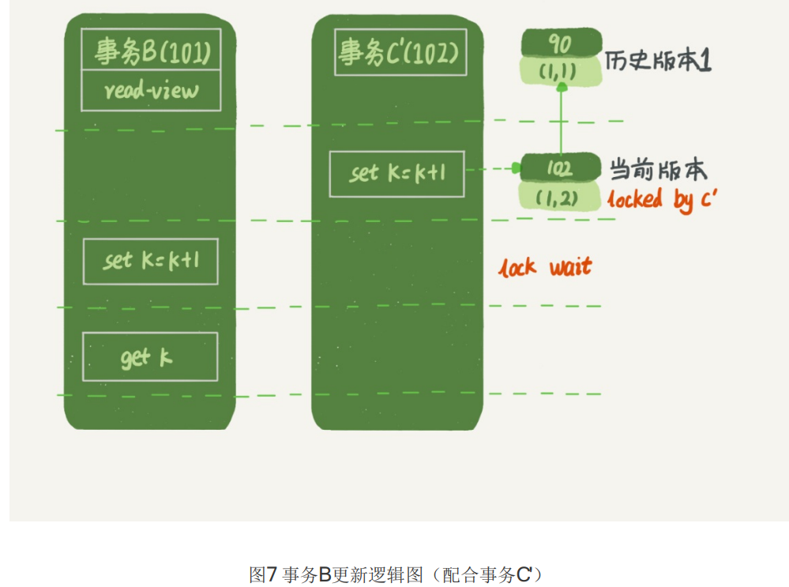
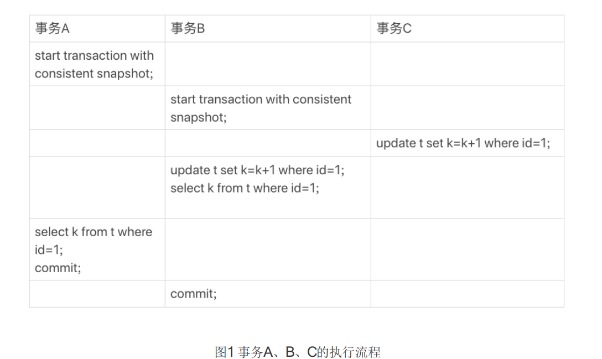
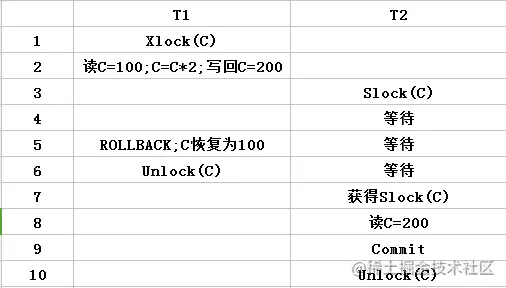

## 整体架构

下面我给出的是MySQL的基本架构示意图，从中你可以清楚地看到SQL语句在MySQL的各个功能模块中的执行过程。


大体来说，MySQL 可以分为 **Server** **层**和**存储引擎层**两部分。

### Server 层

Server 层包括**连接器**、查询缓存、**分析器**(词法分析、语法分析)、**优化器**（==生成sql的执行计划、索引选择==)、**执行器**等，涵盖 MySQL 的大多数核心服务功能，以及所有的内置函数（如日期、时间、数学和加密函数等），所有跨存储引擎的功能都在这一层实现，比如存储过程、触发器、视图等。

其中==连接器直接连接查询缓存和分析器==。

### 存储引擎

而存储引擎层负责==数据的存储和提取==。其架构模式是==插件式==的，支持 InnoDB、MyISAM、Memory 等多个存储引擎。现在最常用的存储引擎是 InnoDB，它从 MySQL 5.5.5 版本开始成为了默认存储引擎。

也就是说，你执行 create table 建表的时候，如果不指定引擎类型，默认使用的就是 InnoDB。不过，你也可以通过指定存储引擎的类型来选择别的引擎，比如在 create table 语句中使用 engine=memory, 来指定使用内存引擎创建表。不同存储引擎的表数据存取方式不同，支持的功能也不同。==不同的存储引擎共用一个Server层。==

#### InnoDB

是 MySQL 默认的事务型存储引擎，只有在需要它不支持的特性时，才考虑使用其它存储引擎。

实现了四个标准的隔离级别，==默认级别是可重复读（REPEATABLE READ）==。==在可重复读隔离级别下，通过多版本并发控制（MVCC）+ Next-Key Locking 防止幻影读。==

主索引是==聚簇索引==，在索引中保存了数据，从而避免直接读取磁盘，因此对查询性能有很大的提升。

内部做了很多优化，包括从磁盘读取数据时采用的可预测性读、能够加快读操作并且自动创建的自适应哈希索引、能够加速插入操作的插入缓冲区等。

==支持真正的在线热备份==。其它存储引擎不支持在线热备份，要获取一致性视图需要停止对所有表的写入，而在读写混合场景中，停止写入可能也意味着停止读取。

#### MyISAM

设计简单，数据以紧密格式存储。对于只读数据，或者表比较小、可以容忍修复操作，则依然可以使用它。

提供了大量的特性，包括压缩表、空间数据索引等。

==不支持事务。==

==不支持行级锁，只能对整张表加锁==，读取时会对需要读到的所有表加共享锁，写入时则对表加排它锁。但在表有读取操作的同时，也可以往表中插入新的记录，这被称为==并发插入==（CONCURRENT INSERT）。

可以手工或者自动执行检查和修复操作，但是和事务恢复以及崩溃恢复不同，可能导致一些数据丢失，而且==修复操作是非常慢==的。

如果指定了 DELAY_KEY_WRITE 选项，在每次修改执行完成时，不会立即将修改的索引数据写入磁盘，而是会写到内存中的键缓冲区，只有在清理键缓冲区或者关闭表的时候才会将对应的索引块写入磁盘。这种方式可以极大的提升写入性能，但是在数据库或者主机崩溃时会造成索引损坏，需要执行修复操作。

#### 比较

- 事务：InnoDB 是事务型的，可以使用 Commit 和 Rollback 语句。
- 并发：MyISAM 只支持表级锁，而 InnoDB 还支持行级锁。
- 外键：InnoDB 支持外键。
- 备份：InnoDB 支持在线热备份。
- 崩溃恢复：MyISAM 崩溃后发生数据丢失的概率比 InnoDB 高很多，而且恢复的速度也更慢。
- 其它特性：MyISAM 支持压缩表和==空间数据索引==。

**MyISAM索引与InnoDB索引的区别？**

- InnoDB索引是聚簇索引，MyISAM索引是非聚簇索引。
- InnoDB的主键索引的叶子节点存储着行数据，因此主键索引非常高效。
- MyISAM索引的==叶子节点存储的是行数据地址==，需要再寻址一次才能得到数据。
- ==InnoDB非主键索引的叶子节点存储的是主键和其他带索引的列数据，因此查询时做到覆盖索引会非常高效？？？==

##### MyISAM和InnoDB的比较

###### MyISAM：

- 不支持事务，而且也不支持外键，但是每次查询都是原子的
- 支持表级锁，即每次操作是对整个表加锁
- 一个MYISAM表有三个文件：索引文件、表结构文件(.frm文件)、数据文件（.MYD文件）
- 采用非聚集索引，索引文件的数据域存储指向数据文件的指针。辅索引与主索引基本一致，但是辅索引不用保证唯一性

> 优点：查询数据相对较==快==，==适合大量的select==，可以全文索引。
>
> **缺点：不支持事务，不支持外键，==并发量较小，不适合大量update==**

###### InnoDb：

- 支持ACID的事务，支持事务的四种隔离级别；
- 支持**行级锁及外键约束**：因此可以支持写并发；
- 不存储总行数；
- 一个InnoDb引擎存储在一个文件空间（共享表空间，表大小不受操作系统控制，一个表可能分布在多个文件里），也有可能为多个（设置为独立表空，表大小受操作系统文件大小限制，一般为2G），受操作系统文件大小的限制；
- 主键索引采用聚集索引（索引的数据域存储数据文件本身），辅索引的数据域存储主键的值；因此从辅索引查找数据，需要先通过辅索引找到主键值，再访问辅索引；最好使用自增主键，防止插入数据时，为维持B+树结构，文件的大调整。

> 优点：支持事务，支持外键，==并发量较大，适合大量update==
>
> **缺点：查询数据相对较==慢==，不适合大量的select**

##### InnoDB 的辅助索引叶子节点为什么不直接保存的记录地址而要存主键键值

想到的一个可能原因是 update 非索引列时，不需要更新辅助索引页。

如果辅助索引存储的是记录地址的话，如果数据记录发生了页裂变导致数据地址变了，那辅助索引也要更新.

本身innodb是以主键为主排序的表。。所以对于innodb来讲，其在磁盘的排序已经由主键的顺序定了，不能再按其它健排序。

其实辅助索引只要主键也有它的优点：==一个磁盘块能存储更多的键值==，使其在进行索引查找是，==只需要读取相对少量的磁盘块就能扫描完全表==，加之读到主键，再查询记录是比较快的。

根本原因是INNODB是主键的索引组织表，其物理存储已经由主键决定，不能再改变在磁盘中的存储顺序。

个人也觉得是跟DML有关，当对一个innodb表进行大量DML后，B+树会分裂，同一行记录的页地址会发生变化。由于辅助索引记录的是主键值，因此完全不用理会这个变化，如果辅助索引记录的是实际页地址，那DML一旦引起B+树分裂，还得与辅助索引进行同步。


### MySQL的逻辑架构图


MySQL 整体上可以分为 Server 层和存储引擎层两部分。

### sql语句的在MySQL内部的执行过程

#### 连接器

第一步，你会先连接到这个数据库上。连接器负责跟客户端建立连接、获取权限、维持和管理连接。

数据库里面，==长连接==是指连接成功后，如果客户端持续有请求，则一直使用同一个连接。==短连接==则是指每次执行完很少的几次查询就断开连接，下次查询再重新建立一个。 建立连接的过程通常是比较复杂的，所以我建议你在使用中要尽量减少建立连接的动作，也就是==尽量使用长连接==。 

但是全部使用长连接后，你可能会发现，有些时候MySQL占用内存涨得特别快，这是因为 MySQL在执行过程中临时使用的==内存是管理在连接对象里面==的。这些资源会在连接断开的时候才释放。所以如果长连接累积下来，==可能导致内存占用太大==，被系统强行杀掉（OOM），从现象看就是MySQL异常重启了。

怎么解决这个问题呢？

你可以考虑以下两种方案。

1. ==定期断开长连接==。使用一段时间，或者程序里面判断执行过一个占用内存的大查询后，断开连接，之后要查询再重连。 
2. 如果你用的是MySQL 5.7或更新版本，可以在每次执行一个比较大的操作后，通过执行 ==mysql_reset_connection来重新初始化连接资源==。这个过程不需要重连和重新做权限验证， 但是会将连接恢复到刚刚创建完时的状态。

#### 查询缓存

连接建立完成后，你就可以执行select语句了。执行逻辑就会来到第二步：查询缓存。

MySQL拿到一个查询请求后，会先到查询缓存看看，之前是不是执行过这条语句。之前执行过的语句及其结果可能会以key-value对的形式，被直接缓存在内存中。key是查询的语句，value是查询的结果。如果你的查询能够直接在这个缓存中找到key，那么这个value就会被直接返回给客户端。

如果语句不在查询缓存中，就会继续后面的执行阶段。执行完成后，执行结果会被存入查询缓存中。你可以看到，如果查询命中缓存，MySQL不需要执行后面的复杂操作，就可以直接返回结果，这个效率会很高。

==注意：若是更新语句，则会在这一步将表T上所有缓存结果都清空。==

但是大多数情况下我会建议你不要使用查询缓存，为什么呢？因为查询缓存往往弊大于利。

##### 查询缓存的缺点

查询缓存的失效非常频繁，==只要有对一个表的更新，这个表上所有的查询缓存都会被清空==。因此 很可能你费劲地把结果存起来，还没使用呢，就被一个更新全清空了。对于更新压力大的数据库来说，查询缓存的命中率会非常低。除非你的业务就是有一张==静态表，很长时间才会更新一次==。 比如，一个系统配置表，那这张表上的查询才适合使用查询缓存。

好在MySQL也提供了这种“按需使用”的方式。你可以将参数query_cache_type设置成 DEMAND，这样对于默认的SQL语句都不使用查询缓存。而对于你确定要使用查询缓存的语句，可以用SQL_CACHE显式指定，像下面这个语句一样：

```sql
mysql> select SQL_CACHE * from T where ID=10；
```

需要注意的是，==MySQL 8.0版本直接将查询缓存的整块功能删掉了==，也就是说8.0开始彻底没有这个功能了。

#### 分析器

如果没有命中查询缓存，就要开始真正执行语句了。要先对SQL语句做解析。

分析器先会做==“词法分析”==。你输入的是由多个字符串和空格组成的一条SQL语句，MySQL需要识别出里面的字符串分别是什么，代表什么。 MySQL从你输入的"select"这个关键字识别出来，这是一个查询语句。它也要把字符串“T”识别 成“表名T”，把字符串“ID”识别成“列ID”。 

做完了这些识别以后，就要做==“语法分析”==。根据词法分析的结果，语法分析器会根据语法规则，判断你输入的这个SQL语句是否满足MySQL语法。

#### 优化器

经过了分析器，MySQL就知道你要做什么了。在开始执行之前，还要先经过优化器的处理。 优化器是在表里面有多个索引的时候，==决定使用哪个索引==；或者在一个语句有多表关联（join） 的时候，==决====定各个表的连接顺序==。

优化器阶段完成后，这个语句的==执行方案==就确定下来了，然后进入执行器阶段。

#### 执行器

MySQL==通过分析器知道了你要做什么，通过优化器知道了该怎么做==，于是就进入了执行器阶段，开始执行语句。 

开始执行的时候，要先==**判断**一下你对这个表T有没有执行**查询的权限**==，如果没有，就会返回没有权限的错误

如果有权限，就打开表继续执行。打开表的时候，执行器就会根据表的引擎定义，去使用这个引擎提供的接口。

### 客户端/服务端通信协议

MySQL客户端/服务端通信协议是==“半双工”==的：在任一时刻，要么是服务器向客户端发送数据，要么是客户端向服务器发送数据，这两个动作不能同时发生。一旦一端开始发送消息，另一端要接收完整个消息才能响应它，所以我们无法也无须将一个消息切成小块独立发送，也没有办法进行流量控制。

客户端用一个单独的数据包将查询请求发送给服务器，所以当查询语句很长的时候，需要设置max_allowed_packet参数。但是需要注意的是，如果查询实在是太大，服务端会拒绝接收更多数据并抛出异常。

与之相反的是，服务器响应给用户的数据通常会很多，由多个数据包组成。但是当服务器响应客户端请求时，客户端必须完整的接收整个返回结果，而不能简单的只取前面几条结果，然后让服务器停止发送。因而在实际开发中，尽量保持查询简单且只返回必需的数据，减小通信间数据包的大小和数量是一个非常好的习惯，==这也是查询中尽量避免使用SELECT *以及加上LIMIT限制的原因之一==。

### 查询缓存

==在解析一个查询语句前，如果查询缓存是打开的，那么MySQL会检查这个查询语句是否命中查询缓存中的数据。如果当前查询恰好命中查询缓存，在检查一次用户权限后直接返回缓存中的结果。这种情况下，查询不会被解析，也不会生成执行计划，更不会执行。==

MySQL将缓存存放在一个引用表（不要理解成table，可以认为是类似于HashMap的数据结构），通过一个==哈希值索引==，这个哈希值通过查询本身、当前要查询的数据库、客户端协议版本号等一些可能影响结果的信息计算得来。所以两个查询在任何字符上的不同（例如：空格、注释），都会导致缓存不会命中。

==如果查询中包含任何用户自定义函数、存储函数、用户变量、临时表、MySQL库中的系统表，其查询结果都不会被缓存，因为会返回不同的结果。==比如函数NOW()或者CURRENT_DATE()会因为不同的查询时间，返回不同的查询结果，再比如包含CURRENT_USER或者CONNECION_ID()的查询语句会因为不同的用户而返回不同的结果，将这样的查询结果缓存起来没有任何的意义。

既然是缓存，就会失效，那查询缓存何时失效呢？MySQL的查询缓存系统会跟踪查询中涉及的每个表，如果这些==表（数据或结构）发生变化，那么和这张表相关的所有缓存数据都将失效==。正因为如此，在任何的写操作时，MySQL必须将对应表的所有缓存都设置为失效。如果查询缓存非常大或者碎片很多，这个操作就可能带来很大的系统消耗，甚至导致系统僵死一会儿。而且查询缓存对系统的额外消耗也不仅仅在写操作，读操作也不例外：

1. 任何的查询语句在开始之前都必须经过检查，即使这条SQL语句永远不会命中缓存
2. 如果查询结果可以被缓存，那么执行完成后，会将结果存入缓存，也会带来额外的系统消耗

基于此，我们要知道==并不是什么情况下查询缓存都会提高系统性能，缓存和失效都会带来额外消耗==，只有当缓存带来的资源节约大于其本身消耗的资源时，才会给系统带来性能提升。但要如何评估打开缓存是否能够带来性能提升是一件非常困难的事情，也不在本文讨论的范畴内。如果系统确实存在一些性能问题，可以尝试打开查询缓存，并在数据库设计上做一些优化，比如：

1. 用多个小表代替一个大表，注意不要过度设计
2. 批量插入代替循环单条插入
3. 合理控制缓存空间大小，一般来说其大小设置为几十兆比较合适
4. 可以通过SQL_CACHE和SQL_NO_CACHE来控制某个查询语句是否需要进行缓存

最后的忠告是==不要轻易打开查询缓存==，特别是写密集型应用。如果你实在是忍不住，可以将query_cache_type设置为DEMAND，这时只有加入SQL_CACHE的查询才会走缓存，其他查询则不会，这样可以非常自由地控制哪些查询需要被缓存。

当然查询缓存系统本身是非常复杂的，这里讨论的也只是很小的一部分，其他更深入的话题，比如：缓存是如何使用内存的？如何控制内存的碎片化？事务对查询缓存有何影响等等，读者可以自行阅读相关资料，这里权当抛砖引玉吧。

### 语法解析和预处理


MySQL通过==关键字==将SQL语句进行解析，并生成一颗对应的==解析树==。

这个过程解析器主要通过语法规则来验证和解析。比如SQL中是否使用了错误的关键字或者关键字的顺序是否正确等等。预处理则会根据MySQL规则进一步检查解析树是否合法。比如检查要查询的数据表和数据列是否存在等。

### 查询优化


经过前面的步骤生成的语法树被认为是合法的了，并且由优化器将其转化成查询计划。多数情况下，一条查询可以有很多种执行方式，最后都返回相应的结果。优化器的作用就是==找到这其中最好的执行计划==。

MySQL使用基于==成本==的优化器，它尝试预测一个查询使用某种执行计划时的成本，并选择其中成本最小的一个。在MySQL可以通过查询当前会话的last_query_cost的值来得到其计算当前查询的成本。

## 事务

### ACID 特性

- 原子性（Atomicity）：事务作为一个整体被执行，包含在其中的对数据库的操作要么全部被执行，要么都不执行。
- 一致性（Consistency）：事务应确保数据库的状态从一个一致状态转变为另一个一致状态，一致状态的含义是数据库中的数据应==满足完整性约束==。在事务开始之前和事务结束之后，数据库的完整性约束没有被破坏。
- 隔离性（Isolation）：多个事务并发执行时，一个事务的执行不应影响其他事务的执行。
- 持久性（Durability）：==已被提交的事务对数据库的修改应该====永久保存在数据库中。==

### 并发事务带来的问题

两个事务T1和T2同时读入同一数据并修改，T2的提交的结果破坏了T1提交的结果，导致T1的修改被丢失（第二类丢失更新）。（应该就是==写覆盖==）

“更新丢失”通常是应该完全避免的。但防止更新丢失，并不能单靠数据库事务控制器来解决，需要应用程序对要更新的数据加必要的锁来解决，因此，==防止更新丢失应该是应用的责任。==

①**脏读**（Dirty read）：当一个事务正在访问数据并且对数据进行了修改，而这种修改还没有提交到数据库中，这时另外一个事务也访问了这个数据，然后使用了这个数据。因为这个数据是还没有提交的数据，那么另外⼀个事务读到的这个数据是“脏数据”，依据“脏数据”所做的操作可能是不正确的。 ==即就是读取到了其他事务还没有提交的数据。==

②**不可重复读**（Unrepeatableread）**:** 指在⼀个事务内多次读同⼀数据。在这个事务还没有结束时，另⼀个事务也访问该数据。那么，在第⼀个事务中的两次读数据之间，由于第⼆个事务的修改导致第⼀个事务两次读取的数据可能不太⼀样。这就发⽣了==在⼀个事务内两次读到的数据是不⼀样==的情况，因此称为不可重复读。 

 **③幻读**（Phantom read）:幻读与不可重复读类似。它发⽣在⼀个事务（T1）读取了⼏⾏数据，接着另⼀个并发事务（T2）插⼊（删除）了⼀些数据时。在随后的查询中，第⼀个事务（T1）就会发现==多了⼀些原本不存在的记录（或者少了一些数据）==，就好像发⽣了幻觉⼀样，所以称为幻读。 

 **不可重复读和幻读区别：** 

 不可重复读的重点是==修改==⽐如多次读取⼀条记录发现其中某些列的值被修改，幻读的重点在于==新增或者删除==⽐如多次读取⼀条记录发现记录增多或减少了。

### 隔离级别

①**read uncommitted(读取未提交)**：最低的隔离级别，指一个事务还没提交时，它做的变更就能被别的事务看到。==可能会导致脏读、幻读或不可重复读。== 

②**read committed(读取已提交)**：指一个事务提交之后，它做的变更才会被其他事务看到。即允许读取并发事务已经提交的数据，==**可以阻止脏读**，但是幻读或不可重复读仍有可能发生。== 

③**repeatable read(可重复读**)：一个事务执行过程中看到的数据，总是跟这个事务在启动时看到的数据是一致的。即==对同一字段的多次读取结果都是一致的==，除非数据是被本身事务自己所修改，==可以解决脏读和不可重复读问题，但幻读仍有可能发生。==

④**serializable(可串行化)**：最高的隔离级别，完全服从ACID的隔离级别。 顾名思义是对于同一行记录，==“写”会加“写锁”，“读”会加“读锁”==。当出现读写锁冲突的时候，后访问的事务必须等前一个事务执行完成，才能继续执行。即所有的事务依此逐个执行，这样事务之间就完全不可能产生干扰，也就是说，==该级别可以防止脏读、不可重复读以及幻读。==

在实现上，数据库里面会创建一个视图，==访问的时候以视图的逻辑结果为准。==**在“可重复读”隔离 级别下，这个视图是在事务启动时创建的**，整个事务存在期间都用这个视图。**在“读提交”隔离级 别下，这个视图是在每个SQL语句开始执行的时候创建的。**这里需要注意的是，**“读未提交”隔离 级别下直接返回记录上的最新值，没有视图概念**；而“串行化”隔离级别下直接用加锁的方式来避免并行访问。

 MySQL InnoDB 存储引擎的**默认⽀持的隔离级别**是 **REPEATABLE-READ**（==可重读，同时也解决了幻读问题==）。InnoDB 存储引擎在==分布式==事务的情况下⼀般会⽤到 ==SERIALIZABLE(可串⾏化)== 隔离级别。

Oracle数据库的默认隔离级别其实就是==“读提交”==，因此对于一些从Oracle迁移到MySQL的应用，为保证数据库隔离级别的一致， 你一定要记得将MySQL的隔离级别设置为“读提交”。


#### 在可重复读(RR)下解决幻读问题 

- 如果是==快照读==，则通过MVCC(多版本控制)来避免幻读.

  - MVCC通过读取版本链上可见记录的方式，来避免脏读，不可重复读，幻读的，毕竟读写不会冲突，可以极大的提高并发度。

- 但是在某些场景下，用户需要读取数据库中的最新记录。这个时候就需要使用==当前读==的方式。如果是当前读，则使用Next-Key Lock 锁（==临键锁==）算法来避免幻读。

  [阿里面试官:MySQL的InnoDB引擎是如何解决幻读问题的？_JavaEdge全是干货的技术号-CSDN博客](https://javaedge.blog.csdn.net/article/details/112209947?spm=1001.2101.3001.6661.1&utm_medium=distribute.pc_relevant_t0.none-task-blog-2~default~CTRLIST~Rate-1.pc_relevant_aa&depth_1-utm_source=distribute.pc_relevant_t0.none-task-blog-2~default~CTRLIST~Rate-1.pc_relevant_aa&utm_relevant_index=1)

  

  - 幻读的原因：行锁只能锁行，但是新插入记录这个动作，要更新的是记录之间的“间隙”。因此，为了解决幻读，InnoDB只好引入==间隙锁(Gap Lock)==，来锁住两个值之间的空隙。

    例子：

    

  ​         初始化插入了6个记录，这就产生了7个间隙。

  ​        表t主键索引上的行锁和间隙锁如下：

  

​      当执行 select * from t where d=5 for update时，就不止是给数据库中已有的6个记录加上了行锁，还同时加了7个间隙锁。这样就确保了无法再插入新记录。即在一行行扫描过程中，==不仅给行加上了行锁，还给行两边的空隙加上了间隙锁。==

间隙锁（加在索引之间的锁）和行锁（加在索引上的锁）合称next-key lock（临键锁），每个next-key lock是==前开后闭==区间。即**next-key锁的原理为：**==将当前数据行与上一条数据和下一条数据之间的间隙锁定，保证此范围内读取数据是一致的；==


~~InnoDB 存储引擎在 REPEATABLE-READ（可重读） 事务隔离级别下使⽤的是Next-Key Lock 锁[算法]()，因此可以避免幻读的产⽣。~~ 

 ~~方法：是通过next-key lock在当前读事务开启时。~~ 

 ~~1.给涉及到的行加写锁(行锁)，防止写操作；~~ 

~~2.给涉及到的行两端加间隙锁(Gap Lock)，防止行新增插入；~~ 

 ~~从而解决了幻读问题。~~ 

###   日志系统(redo与undo)

InnoDB存储引擎两种事务日志：

- redo log(重做日志)： 用于保证事务持久性（WAL技术，Write-Ahead Logging,日志先行）
- undo log(回滚日志)：事务原子性和隔离性实现的基础

#### undo log

undo log是现==原子性==的关键，是当事务==回滚==时能够撤销所有已经成功执行的 sql 语句。

undo log主要记录的是数据的逻辑变化，为了在发生错误时回滚之前的操作，需要将之前的操作都记录下来，然后在发生错误时才可以回滚。

==**undo log的作用**==

undo是一种==逻辑日志==，有两个作用：

- 用于事务的回滚
- MVCC

InnoDB 实现回滚，靠的是 undo log：

- 当事务对数据库进行修改时，InnoDB 会生成对应的 undo log。
- 如果事务执行失败或调用了 rollback，导致事务需要回滚，便可以利用 undo log 中的信息将数据回滚到修改之前的样子。

undo log 属于逻辑日志，它记录的是 sql 执行相关的信息。

当发生回滚时，InnoDB 会根据 undo log 的内容做与之前相反的工作：

- 对于每个 insert，回滚时会执行 delete。
- 对于每个 delete，回滚时会执行 insert。
- 对于每个 update，回滚时会执行一个相反的 update，把数据改回去。

以 update 操作为例：当事务执行 update 时，其生成的 undo log 中会包含被修改行的主键(以便知道修改了哪些行)、修改了哪些列、这些列在修改前后的值等信息，回滚时便可以使用这些信息将数据还原到 update 之前的状态。

#### redo log 

InnoDB 作为 MySQL 的存储引擎，数据是存放在磁盘中的，但如果每次读写数据都需要磁盘 IO，效率会很低。

为此，InnoDB 提供了缓存(Buffer Pool)，Buffer Pool 中包含了磁盘中部分数据页的映射，作为访问数据库的缓冲：

- 当从数据库读取数据时，会首先从 Buffer Pool 中读取，如果 Buffer Pool 中没有，则从磁盘读取后放入 Buffer Pool。
- 当向数据库写入数据时，会首先写入 Buffer Pool，Buffer Pool 中修改的数据会定期刷新到磁盘中(这一过程称为刷脏)。

Buffer Pool（缓存） 的使用大大==提高了读写数据的效率==，但是也带来了新的问题：如果 MySQL 宕机，而此时 Buffer Pool 中修改的数据还没有刷新到磁盘，就会导致数据的丢失，事务的持久性无法保证。

于是，redo log 被引入来解决这个问题：当数据修改时，除了修改 Buffer Pool 中的数据，还会在 redo log 记录这次操作;==当事务提交时，会调用 fsync 接口对 redo log 进行刷盘。==如果 MySQL 宕机，重启时可以读取 redo log 中的数据，对数据库进行恢复。

redo log 采用的是 WAL(Write-ahead logging，预写式日志)，==所有修改先写入redo日志，再更新到 Buffer Pool==，保证了数据不会因 MySQL 宕机而丢失，从而满足了持久性要求。如果数据库在redo log日志落盘前崩溃，那么相应的数据修改会回滚，因为这个时候事务没有提交；若是在日志落盘后(已经提交)崩溃，则redo log会保证相应的修改不丢失。

事务的执行过程中，生成的 redo log 是要先写到 redo log buffer 的。

redo log 三种状态：

- 存在 redo log buffer 中，物理上是在 MySQL 进程内存中
- 写到磁盘（write），但是没有持久化（fsync），物理上是在文件系统的 page cache 里
- 持久化磁盘，对应的是 hard disk

日志写到 redo log buffer 是很快的，write 到 page cache 也差不多，但是持久化到磁盘的速度就慢多了。

InnoDB 提供了 innodb_flush_log_at_trx_commit 参数，取值如下：

1. 设置为 0 时，表示每次事务提交时都只是把 redo log 留在 redo log buffer 中；
2. ==设置为 1 时，表示每次事务提交时都将 redo log 直接持久化到磁盘==；
3. 设置为 2 时，表示每次事务提交时都只是把 redo log 写到 page cache。

==写入Redo的时机：==

- 在数据页修改完成之后，在脏页刷出磁盘之前，写入redo日志。注意的是先修改内存中的数据，后写日志
- **redo日志比数据页先写回磁盘**（日志先行，先写日志，再写磁盘）
- 聚集索引、二级索引、undo页面的修改，均需要记录Redo日志。

redo log是固定大小的，所以只能==循环写==，从头开始写，写到末尾就又回到开头，相当于一个环形。当日志写满了，就需要对旧的记录进行==擦除==，但在擦除之前，需要确保这些要被擦除记录对应在内存中的数据页都已经刷到磁盘中了。==在redo log满了到擦除旧记录腾出新空间这段期间，是不能再接收新的更新请求==，所以有可能会导致MySQL卡顿。（所以针对并发量大的系统，适当设置redo log的文件大小非常重要！！！）


**==既然 redo log 也需要在事务提交时将日志写入磁盘，为什么它比直接将 Buffer Pool 中修改的数据写入磁盘(即刷脏)要快呢?==**

主要有以下两方面的原因：

- ==刷脏是随机 IO==，因为每次修改的数据位置随机，需要在磁盘的多个地方移动磁头，但写 redo log 是==追加操作==，只需要在顺序磁盘上一小块区域内的==顺序I/O==。
- 刷脏==是以数据页(Page)为单位的==，MySQL 默认页大小是 16KB，一个 Page 上一个小修改都要整页写入;而在redo log 中只包含真正需要写入的部分，无效 IO 大大减少。

#### binlog

前面我们讲过，MySQL整体来看，其实就有两块：一块是Server层，它主要做的是MySQL功能层面的事情；还有一块是引擎层，负责存储相关的具体事宜。上面我们聊到的redo log是 InnoDB引擎特有的日志，==而Server层也有自己的日志，称为binlog（归档日志）。==

为什么会有两份日志呢？

因为最开始MySQL里并没有InnoDB引擎。MySQL自带的引擎是MyISAM，但是MyISAM没有 ==crash-safe==（即能够保证MySQL在任何时间段突然奔溃，重启后之前提交的记录都不会丢失）的能力，binlog日志只能用于==归档==。而InnoDB是另一个公司以插件形式引入MySQL 的，既然==只依靠binlog是没有crash-safe能力的==，所以InnoDB使用另外一套日志系统—也就是 redo log来实现crash-safe能力。

binlog是MySQL的Server层实现的，所有引擎都可以使用。

binlog是==逻辑日志==，记录的是这个语句的原始逻辑，比如“给ID=2这一行的c字段加1 ”。

binlog是可以==追加写入==的。“追加写”是指binlog文件 写到一定大小后会切换到下一个，并不会覆盖以前的日志。

#### redolog与binlog

1. redo log是InnoDB引擎特有的；binlog是MySQL的Server层实现的，所有引擎都可以使用。 
2. redo log是物理日志，==记录的是“在某个数据页上做了什么修改”==；binlog是逻辑日志，记录的是这个语句的==原始逻辑==（也就是一条条的sql），比如“给ID=2这一行的c字段加1 ”。
3.  redo log是循环写的，空间固定会用完；binlog是可以==追加写入==的。“追加写”是指binlog文件 写到一定大小后会切换到下一个，并不会覆盖以前的日志。

#### redo log两阶段提交

update语句执行过程

这个表有一个主键ID和一个整型字段c：

```sql
mysql> create table T(ID int primary key, c int);
```

 如果要将ID=2这一行的值加1，SQL语句就会这么写： 

```sql
mysql> update T set c=c+1 where ID=2;
```

有了对这两个日志的概念性理解，我们再来看执行器和InnoDB引擎在执行这个==简单的update语句时的内部流程。==

1. 执行器先找引擎取ID=2这一行。ID是主键，引擎直接用树搜索找到这一行。如果ID=2这一行所在的数据页本来就在内存中，就直接返回给执行器；否则，需要先从磁盘读入内存，然后再返回。

2. 执行器拿到引擎返回的行数据，把这个值加上1，比如原来是N，现在就是N+1，得到新的一行数据，再调用引擎接口写入这行新数据。 
3. 引擎将这行新数据更新到内存中，同时将这个更新操作记录到redo log里面，此时redo log处于prepare状态。然后告知执行器执行完成了，随时可以提交事务。 
4. 执行器生成这个操作的binlog，并把binlog写入磁盘。
5.  执行器调用引擎的提交事务接口，引擎把刚刚写入的redo log改成提交（commit）状态，更新完成。 

这里我给出这个update语句的执行流程图，图中浅色框表示是在InnoDB内部执行的，深色框表示是在执行器中执行的。


你可能注意到了，最后三步看上去有点“绕”，将redo log的写入拆成了两个步骤：prepare和 commit，这就是"两阶段提交"

为什么必须有“两阶段提交”呢？

==这是为了让redo log和binlog两份日志之间的逻辑一致==。要说明这个问题，我们得从文章开头的那个问题说起：怎样让数据库恢复到半个月内任意一秒的状态？ 前面我们说过了，binlog会记录所有的逻辑操作，并且是采用“追加写”的形式。如果你的DBA承诺说半个月内可以恢复，那么备份系统中一定会保存最近半个月的所有binlog，同时系统会定期做整库备份。这里的“定期”取决于系统的重要性，可以是一天一备，也可以是一周一备。

 当需要恢复到指定的某一秒时，比如某天下午两点发现中午十二点有一次误删表，需要找回数据，那你可以这么做：

-  首先，找到最近的一次全量备份，如果你运气好，可能就是昨天晚上的一个备份，从这个备份恢复到临时库； 
- 然后，从备份的时间点开始，将备份的binlog依次取出来，重放到中午误删表之前的那个时刻。 

这样你的临时库就跟误删之前的线上库一样了，然后你可以把表数据从临时库取出来，按需要恢复到线上库去。

 好了，说完了数据恢复过程，我们回来说说，为什么日志需要“两阶段提交”。这里不妨用反证法来进行解释。 由于redo log和binlog是两个独立的逻辑，如果不用两阶段提交，要么就是先写完redo log再写 binlog，或者采用反过来的顺序。我们看看这两种方式会有什么问题。

 仍然用前面的update语句来做例子。假设当前ID=2的行，字段c的值是0，再假设执行update语句过程中在写完第一个日志后，第二个日志还没有写完期间发生了crash，会出现什么情况呢？ 

1. 若先写redo log后写binlog。假设在redo log写完，binlog还没有写完的时候，MySQL进程异常重启。由于我们前面说过的，redo log写完之后，系统即使崩溃，仍然能够把数据恢复回来，所以恢复后这一行c的值是1。 但是由于binlog没写完就crash了，这时候binlog里面就没有记录这个语句。因此，之后备份日志的时候，存起来的binlog里面就没有这条语句。 然后你会发现，如果需要用这个binlog来恢复临时库的话，由于这个语句的binlog丢失，这个临时库就会少了这一次更新，恢复出来的这一行c的值就是0，与原库的值不同。 
2. 若先写binlog后写redo log。如果在binlog写完之后crash，由于redo log还没写，崩溃恢复以后这个事务无效，所以这一行c的值是0。但是binlog里面已经记录了“把c从0改成1”这个日志。所以，在之后用binlog来恢复的时候就多了一个事务出来，恢复出来的这一行c的值就是 1，与原库的值不同。 

可以看到，如果不使用“两阶段提交”，那么数据库的状态就有可能和用它的日志恢复出来的库的状态不一致。

==redo log和binlog都可以用于表示事务的提交状态，而两阶段提交就是让这两个状态保持逻辑上的一致。==

### 事务隔离的实现

理解了事务的隔离级别，我们再来看看事务隔离具体是怎么实现的。这里我们展开说明“可重复读”。

 在MySQL中，实际上每条记录在更新的时候都会同时记录一条回滚操作(undo log)。记录上的最新值，通过回滚操作，都可以得到前一个状态的值。

 假设一个值从1被按顺序改成了2、3、4，在回滚日志(undo log)里面就会有类似下面的记录。


当前值是4，但是在查询这条记录的时候，不同时刻启动的事务会有不同的read-view。如图中看到的，在视图A、B、C里面，这一个记录的值分别是1、2、4，==同一条记录在系统中可以存在多个版本==，就是数据库的多版本并发控制（MVCC）。对于read-view A，要得到1，就必须将当前值依次执行图中所有的回滚操作得到。

同时你会发现，即使现在有另外一个事务正在将4改成5，这个事务跟read-viewA、B、C对应的事务是不会冲突的。

 你一定会问，回滚日志总不能一直保留吧，什么时候删除呢？答案是，==在不需要的时候才删除。== 

也就是说，系统会判断，==当没有事务再需要用到这些回滚日志时，回滚日志会被删除。== 什么时候才不需要了呢？就是==当系统里没有比这个回滚日志更早的read-view的时候。==

#### 为什么建议你尽量不要使用长事务

基于上面的说明，我们来讨论一下为什么建议你尽量不要使用长事务。

长事务意味着系统里面会存在很老的事务视图。由于这些事务随时可能访问数据库里面的任何数据，所以==这个事务提交之前，数据库里面它可能用到的回滚记录都必须保留，这就会导致大量占用存储空间==。 除了对回滚段的影响，==长事务还占用锁资源，也可能拖垮整个库。==

#### 事务的启动方式 

如前面所述，长事务有这些潜在风险，我当然是建议你尽量避免。其实很多时候业务开发同学并不是有意使用长事务，通常是由于误用所致。MySQL的事务启动方式有以下几种： 

1. 显式启动事务语句， begin 或 start transaction。配套的提交语句是commit，回滚语句是 rollback。 
2. set autocommit=0，这个命令会将这个线程的自动提交关掉。意味着如果你只执行一个 select语句，这个事务就启动了，而且并不会自动提交。这个事务持续存在直到你主动执行 commit 或 rollback 语句，或者断开连接。

 有些客户端连接框架会默认连接成功后先执行一个set autocommit=0的命令。这就导致接下来的查询都在事务中，如果是长连接，就导致了意外的长事务。 因此，我会建议你总是使用set autocommit=1, 通过显式语句的方式来启动事务。

但是有的开发同学会纠结“多一次交互”的问题。对于一个需要频繁使用事务的业务，第二种方式 每个事务在开始时都不需要主动执行一次 “begin”，减少了语句的交互次数。如果你也有这个顾虑，我建议你使用==commit work and chain==语法。 

在autocommit为1的情况下，用begin显式启动的事务，如果执行commit则提交事务。如果执行 commit work and chain，则是提交事务并自动启动下一个事务，这样也省去了再次执行begin语句的开销。同时带来的好处是从程序开发的角度明确地知道每个语句是否处于事务中。

### MVCC

人们一般把基于锁的并发控制机制称成为悲观机制，而把MVCC机制称为乐观机制。这是因为锁机制是一种预防性的，读会阻塞写，写也会阻塞读，当锁定粒度较大，时间较长时并发性能就不会太好；而MVCC是一种后验性的**，读不加锁，读不阻塞写，写也不阻塞读，等到提交的时候才检验是否有冲突，由于没有锁，所以读写不会相互阻塞，从而大大提升了并发性能。**

MVCC(Multi Version Concurrency Control)，中文名是多版本并发控制，简单来说就是==通过undo log日志维护数据的历史版本，然后通过视图数组来判断各数据版本对事务的可见性，从而解决并发访问情况下的读一致性问题==。

在MVCC并发控制中，读操作可以分成两类：==快照读 (snapshot read)==与==当前读 (current read)==。快照读，读取的是记录的==可见版本== (有可能是历史版本)，不用加锁。当前读，读取的是记录的==最新版本==，并且，当前读返回的记录，==都会加上锁==，保证其他事务不会再并发修改这条记录。

- 快照读：读取的是记录的==可见版本== (有可能是历史版本)，不用加锁
  - 简单的select操作，属于快照读，不加锁。

- 当前读：读取的是记录的==最新版本==。特殊的读操作，插入/更新/删除操作，属于当前读，==需要加锁==
  - select * from table where ? lock in share mode;
  - select * from table where ? for update;
  - insert into table values (…);
  - update table set ? where ?;
  - delete from table where ?;
  - 所有以上的语句，都属于当前读，读取记录的最新版本。并且，读取之后，还需要保证其他并发事务不能修改当前记录，对读取记录加锁。其中，除了第一条语句，对读取记录加S锁 (共享锁)外，其他的操作，都加的是X锁 (排它锁)。

注：==可重复读是通过MVCC来实现的。在快照读读情况下，mysql通过mvcc来避免幻读。在当前读情况下，通过next-key来避免幻读。即MVCC+行锁+间隙锁解决了Mysql默认不解决幻读==


#### “快照”在MVCC里是怎么工作的？

在可重复读隔离级别下，事务在启动的时候就“拍了个快照”。注意，这个快照是基于整库的。

这时，你会说这看上去不太现实啊。如果一个库有100G，那么我启动一个事务，MySQL就要拷贝100G的数据出来，这个过程得多慢啊。可是，我平时的事务执行起来很快啊。 

实际上，我们并不需要拷贝出这100G的数据。我们先来看看这个快照是怎么实现的。

 InnoDB里面每个事务有一个唯一的事务ID，叫作transaction id。它是在事务开始的时候向 InnoDB的事务系统申请的，是按申请顺序==严格递增==的。而每行数据也都是有多个版本的。==每次事务更新数据的时候，都会生成一个新的数据版本==，并且把transaction id赋值给这个数据版本的事务ID，记为rowtrx_id(事务id)。同时，旧的数据版本要保留，并且在新的数据版本中，能够有信息可以直接拿到它。 

也就是说，数据表中的一行记录，其实可能有多个版本(row)，每个版本有自己的rowtrx_id(事务id)。如下图所示，就是一个记录被多个事务连续更新后的状态


图中虚线框里是同一行数据的4个版本，当前最新版本是V4，k的值是22，它是被transaction id 为25的事务更新的，因此它的rowtrx_id也是25。

前面的文章不是说，语句更新会生成undo log（回滚日志）吗？那么，undo log 在哪呢？

实际上，上图中的三个虚线箭头，就是undo log；而V1、V2、V3并不是物理上真实存在的，==而是每次需要的时候根据当前版本和undo log计算出来的==。比如，需要V2的时候，就是通过V4依次执行U3、U2算出来。

按照可重复读的定义，一个事务启动的时候，能够看到所有已经提交的事务结果。但是之后，这个事务执行期间，其他事务的更新对它不可见。

因此，一个事务只需要在启动的时候声明说，“以我启动的时刻为准，如果一个数据版本是在我启动之前生成的，就认；如果是我启动以后才生成的，我就不认，我必须要找到它的上一个版本”。 当然，如果“上一个版本”也不可见，那就得继续往前找。还有，如果是这个事务自己更新的数据，它自己还是要认的。

##### 视图数组

==在实现上，InnoDB为每个事务构造了一个数组，用来保存这个事务启动瞬间，当前正在“活跃”的所有事务ID。“活跃”指的就是，启动了但还没提交。==数组里面事务ID的最小值记为**低水位**，当前系统里面==已经创建过的事务ID==的最大值加1记为**高水位**(==**并不是系统正在活跃的事务的最大id+1**==)。

这个==视图数组==和高水位，就组成了当前事务的==一致性视图（read-view）==。

而数据版本的可见性规则，就是基于数据版本的rowtrx_id（事务id）和这个一致性视图的对比结果得到的。这个视图数组把所有的rowtrx_id分成了几种不同的情况。


这样，对于当前事务的启动瞬间来说，一个数据版本的rowtrx_id，有以下几种可能：

1. 如果落在绿色部分，表示这个版本是已提交的事务或者是当前事务自己生成的，这个数据是可见的；

2. 如果落在红色部分，表示这个版本是由将来启动的事务生成的，是肯定不可见的； 

3. 如果落在黄色部分，那就包括两种情况 

   a. 若 rowtrx_id在数组中，表示这个版本是由还没提交的事务生成的，不可见；

   b. 若 rowtrx_id不在数组中，表示这个版本是已经提交了的事务生成的，可见。

>```mysql
>-- 假设存在事务T1,T2,T4,T7,T8,T9，其中T2,T4,T8活跃状态，此刻启动事务A(此时说明，T1,T7,T9已经提交)
>
>-- 事务A的视图数组viewA如下
>viewA = [T2,T4,T8]
>
>-- 低水位
>lowLevel = T2
>    
>-- 高水位
>highLevel = T9 + 1 = T10
>    
>-- T1：T1 < T2，即处于绿色部分，对于事务A可见
>-- T11：T11 > T10，即处于红色部分，对于事务A不可见
>-- T4：T4 > T2 && T4 < T10，即处于黄色部分，且存在viewA中，说明未提交不可见
>-- T7：T7 > T2 && T7 < T10，即处于黄色部分，但不存在viewA中，说明已提交可见
>```
>
>

比如，对于图2中的数据来说，如果有一个事务，它的低水位是18，那么当它访问这一行数据 时，就会从V4通过U3计算出V3，所以在它看来，这一行的值是11。 你看，有了这个声明后，系统里面随后发生的更新，是不是就跟这个事务看到的内容无关了呢？ 因为之后的更新，生成的版本一定属于上面的2或者3(a)的情况，而对它来说，这些新的数据版 本是不存在的，所以这个事务的快照，就是“静态”的了。 所以你现在知道了，InnoDB利用了“所有数据都有多个版本”的这个特性，实现了“秒级创建 快照”的能力。


接下来，我们继续看一下之前提到的图1中的三个事务，分析下事务A的语句返回的结果，为什么是k=1。 这里，我们不妨做如下假设：

1. 事务A开始前，系统里面只有一个活跃事务ID是99； 

2. 事务A、B、C的版本号分别是100、101、102，且当前系统里只有这四个事务； 
3. 三个事务开始前，(1,1）这一行数据的rowtrx_id是90。

这样，事务A的==**视图数组**==就是[99,100]（因为事务b,c是在事务a启动之后启动的，因此感知不到）, 事务B的视图数组是[99,100,101], 事务C的视图数组是 [99,100,101,102]。

为了简化分析，我先把其他干扰语句去掉，只画出跟事务A查询逻辑有关的操作：


从图中可以看到，第一个有效更新是事务C，把数据从(1,1)改成了(1,2)。这时候，这个数据的最新版本的rowtrx_id是102，而90这个版本已经成为了历史版本。

第二个有效更新是事务B，把数据从(1,2)改成了(1,3)。这时候，这个数据的最新版本（即row trx_id）是101，而102又成为了历史版本。（==因为更新数据是先读后写，因此能够看到（1,2）版本的数据，即更新是**当前读**）==

注意，在事务A查询的时候，其实事务B还没有提交，但是它生成的(1,3)这个版本已经变成当前版本了。但这个版本对事务A必须是不可见的，否则就变成脏读了。

##### 查询逻辑

现在事务A要来读数据了，它的视图数组是[99,100]。当然了，读数据都是从当前版本读起的。所以，事务A查询语句的读数据流程是这样的：

- 找到(1,3)的时候，判断出rowtrx_id=101，比高水位大，处于红色区域，不可见； 
- 接着，找到上一个历史版本，一看rowtrx_id=102，比高水位大，处于红色区域，不可见； 
- 再往前找，终于找到了（1,1)，它的rowtrx_id=90，比低水位小，处于绿色区域，可见。

这样执行下来，虽然期间这一行数据被修改过，但是事务A不论在什么时候查询，看到这行数据 的结果都是一致的，所以我们称之为**==一致性读==**。

==总结==

一个数据版本，对于一个事务视图来说，除了自己的更新总是可见以外，有三种情况：

1. 版本未提交，不可见； 
2. 版本已提交，但是是在视图创建后提交的，不可见； 
3. 版本已提交，而且是在视图创建前提交的，可见。

##### 更新逻辑

事务B的update语句，如果按照一致性读，好像结果不对哦？

看图5中，事务B的视图数组是先生成的，之后事务C才提交，不是应该看不见(1,2)吗，怎么能算出(1,3)来


是的，如果事务B在更新之前查询一次数据，这个查询返回的k的值确实是1。

但是，当它要去更新数据的时候，就不能再在历史版本上更新了，否则事务C的更新就丢失了。 因此，事务B此时的set k=k+1是在（1,2）的基础上进行的操作。

所以，这里就用到了这样一条规则：==更新数据都是先读后写的，而这个读，只能读当前的值，**称为“当前读”（current read）**。==

因此，在更新的时候，当前读拿到的数据是(1,2)，更新后生成了新版本的数据(1,3)，这个新版本 的rowtrx_id是101。所以，在执行事务B查询语句的时候，一看自己的版本号是101，最新数据的版本号也是101，是自己的更新，可以直接使用，所以查询得到的k的值是3。

这里我们提到了一个概念，叫作==当前读==。其实，除了update语句外，==select语句如果加锁，也是当前读==。所以，如果把事务A的查询语句select *from t where id=1修改一下，加上lock in share mode 或 for update，也都可以读到版本号是101的数据，返回的k的值是3。下面这两个select语句，就是分别加了读锁（S锁，共享锁）和写锁（X锁，排他锁）。

```sql
mysql> select k from t where id=1 lock in share mode;
mysql> select k from t where id=1 for update;
```

再往前一步，假设事务C不是马上提交的，而是变成了下面的事务C’，会怎么样呢？


事务C’的不同是，更新后并没有马上提交，在它提交前，事务B的更新语句先发起了。前面说过了，虽然事务C’还没提交，但是(1,2)这个版本也已经生成了，并且是当前的最新版本。那么，事务B的更新语句会怎么处理呢？

这时候，我们在上一篇文章中提到的“==两阶段锁协议==”就要上场了。事务C’没提交，也就是说(1,2) 这个版本上的写锁还没释放。而事务B是==当前读==，必须要读最新版本，而且==必须加锁==，因此就被锁住了，必须等到事务C’释放这个锁，才能继续它的当前读。



到这里，我们把一致性读、当前读和行锁就串起来了。

##### 总结

==**可重复读**的核心就是**一致性读**（consistent read）；而**事务更新**数据的时候，只能用**当前读**，即如果当前的记录的行锁被其他事务占用的话，就需要进入锁等待。==

##### 可重复读与读提交的区别

而读提交的逻辑和可重复读的逻辑类似，它们最主要的区别是：

- 在可重复读隔离级别下，只需要在==事务开始的时候创建一致性视图==，之后事务里的其他查询都共用这个一致性视图； 
- 在读提交隔离级别下，==每一个语句执行前都会重新算出一个新的视图。==

那么，我们再看一下，在读提交隔离级别下，事务A和事务B的查询语句查到的k，分别应该是多少呢？

这里需要说明一下，“start transaction with consistent snapshot; ”的意思是从这个语句开始，创建一个持续整个事务的一致性快照。所以，在读提交隔离级别下，这个用法就没意义了，等效于 普通的start transaction。

下面是==读提交时的状态图==，可以看到这两个查询语句的创建视图数组的时机发生了变化，就是图中的read view框。（注意：这里，我们用的还是事务C的逻辑直接提交，而不是事务C’）

注：事务A开始前，系统里面还是只有一个活跃事务ID是99




这时，事务A的查询语句的视图数组是在执行这个语句的时候创建的，时序上(1,2)、(1,3)的生成时间都在创建这个视图数组的时刻之前。但是，在这个时刻：

- ==事务A的视图数组（99，100,101），低水位为99，高水位为102+1=103==

- ==(1,3)还没提交，不可见。（此时（1,3）数据版本的id为101大于99且小于103，但是在A是视图数组当中，因此不可见）==
- ==(1,2)提交了，可见。 （此时（1,2）数据版本的id为102大于99且小于103，但是不在A是视图数组当中，因此可见）==

所以，这时候事务A查询语句返回的是k=2。 显然地，事务B查询结果k=3。


#### 版本链

==MVCC只在**读提交、可重复读**两种隔离级别下工作。==

在`InnoDB`中，每行记录实际上都包含了两个隐藏字段：事务id(`trx_id`)和回滚指针(`roll_pointer`)。

1. `trx_id`：事务id。每次修改某行记录时，都会把该事务的事务id赋值给`trx_id`隐藏列。
2. `roll_pointer`：回滚指针。每次修改某行记录时，都会把`undo`日志中相应记录的地址赋值给`roll_pointer`隐藏列。

假设`hero`表中只有一行记录，当时插入的事务id为80。此时，该条记录的示例图如下：  

假设之后两个事务`id`分别为`100`、`200`的事务对这条记录进行`UPDATE`操作，操作流程如下：

  

由于每次变动都会先把`undo`日志记录下来，并用`roll_pointer`指向`undo`日志中相应的记录地址。因此可以认为，**对该条记录的修改日志串联起来就形成了一个`版本链`，版本链的头节点就是当前记录最新的值**。如下： 

#### ReadView(一致性视图)

如果数据库隔离级别是`未提交读（READ UNCOMMITTED）`，那么读取版本链中最新版本的记录即可。如果是是`串行化（SERIALIZABLE）`，事务之间是加锁执行的，不存在读不一致的问题。**但是如果是`已提交读（READ COMMITTED）`或者`可重复读（REPEATABLE READ）`，就需要遍历版本链中的每一条记录，判断该条记录是否对当前事务可见，直到找到为止(遍历完还没找到就说明记录不存在)**。`InnoDB`通过`ReadView`实现了这个功能。

`ReadView`功能：

- Read View就是事务执行（可重复读）或者sql语句执行(读提交)时，生成数据库系统当前的一个快照，记录当前系统中还有哪些活跃的读写事务，把它们放到一个列表里。
- Read View主要是用来做可见性判断的，即判断当前事务可见哪个版本的数据

`ReadView`中主要包含以下4个内容：

- `m_ids（视图数组）`：表示在生成`ReadView`时当前系统中活跃的读写事务的事务id列表。它数据结构为一个List。
- `min_trx_id（低水位）`：表示在生成`ReadView`时当前系统中活跃的读写事务中最小的事务id，也就是`m_ids`中的最小值。
- `max_trx_id`（高水位）：表示生成`ReadView`时系统中应该分配给**下一个事务的id值**。最大的事务ID。
- `creator_trx_id`：表示生成该`ReadView`事务的事务id。

有了`ReadView`之后，我们可以基于以下步骤判断某个版本的记录是否对当前事务可见。

==事务在读数据都是读取当前数据库中的最新版本数据，然后根据当前的读取的版本号和当前事务的视图数组，计算该事务可见的数据版本。==

1. 如果被访问版本的`trx_id`属性值与`ReadView`中的`creator_trx_id`值相同，意味着当前事务在访问它自己修改过的记录，所以该版本可以被当前事务访问。
2. 如果被访问版本的`trx_id`属性值小于`ReadView`中的`min_trx_id（低水位）`值，表明生成该版本的事务在当前事务生成`ReadView`前已经提交，所以该版本可以被当前事务访问。(因为事务ID是递增的）
3. 如果被访问版本的`trx_id`属性值大于或等于`ReadView`中的`max_trx_id`（高水位）值，表明生成该版本的事务在当前事务生成`ReadView`后才开启，所以该版本不可以被当前事务访问。
4. 如果被访问版本的`trx_id`属性值在`ReadView`的`min_trx_id`和`max_trx_id`之间，那就需要判断一下`trx_id`属性值是不是在`m_ids`（视图数组）列表中，如果在，说明创建`ReadView`时生成该版本的事务还是活跃的，该版本不可以被访问；如果不在，说明创建`ReadView`时生成该版本的事务已经被提交，该版本可以被访问。

在`MySQL`中，`读提交`和`可重复读`隔离级别的的一个非常大的区别就是它们生成`ReadView（一致性视图）`的时机不同。`读提交`，这样就能保证每次都能读到其它事务已提交的数据。**`可重复读` 只在第一次读取数据时生成一个`ReadView`**，这样就能保证后续读取的结果完全一致。

#### MVCC总结

==MVCC是个行级锁的变种，它在普通读情况下避免了加锁操作，因此开销更低。虽然实现不同，但通常都是实现**非阻塞读**，**写操作只锁定必要的行**。==

MVCC 的特点：在同一时刻，不同的事务读取到的数据可能是不同的(即多版本)

MVCC 最大的优点是==读不加锁==，因此读写不冲突，并发性能好。InnoDB 实现 MVCC，多个版本的数据可以共存，主要是依靠数据的隐藏列(也可以称之为标记位)和undo log。

其中数据的隐藏列包括了该行数据的版本号、删除时间、指向 undo log 的指针等等。

当读取数据时，MySQL 可以通过隐藏列判断是否需要回滚并找到回滚需要的 undo log，从而实现 MVCC。


## 锁

### 锁机制

首先来看两个事务的写操作之间的相互影响。隔离性要求同一时刻只能有一个事务对数据进行写操作，可以通过锁机制来保证这一点。

锁机制的基本原理可以概括为：事务==在修改数据之前，需要先获得相应的锁==；获得锁之后，事务便可以修改数据；该事务操作期间，这部分数据是锁定的，其他事务如果需要修改数据，需要等待当前事务提交或回滚后释放锁。

### 锁分类

Mysql中锁的分类按照不同类型的划分可以分成不同的锁，按照**「锁的粒度」**划分可以分成：**「全局锁、表锁、页锁、行锁」**；按照**「使用的方式」**划分可以分为：**「共享锁」**和**「排它锁」**；按照思想的划分：**「乐观锁」**和**「悲观锁」**。按状态分为：意向共享锁、意向排它锁。按算法分为：间隙锁、临键锁、记录锁。

#### 全局锁

##### 概念

全局锁就是对整个数据库实例加锁。

#####  应用场景

==全库逻辑备份（mysqldump）==。也就是把整库每个表都select出来存成文本。

#####  实现方式

MySQL 提供了一个加全局读锁的方法，命令是Flush tables with read lock (FTWRL)。

当你需要让整个库处于==只读状态==的时候，可以使用这个命令，之后其他线程的以下语句会被阻塞：数据更新语句（数据的增删改）、数据定义语句（包括建表、修改表结构等）和更新类事务的提交语句。

做全库逻辑备份，以前有一种做法，通过FTWRL确保不会有其他线程对数据库做更新，然后对整个库做备份。 注意，在备份过程中整个库完全处于只读状态，这样做的风险是：

- 如果在主库上备份，那么在备份期间都不能执行更新，业务基本上就能停止。

- 如果在从库上备份，那么备份期间从库不能执行主库同步过来的binlog，会导致主从延迟。


官方自带的逻辑备份工具是mysqldump。==mysqldump使用参数--single-transaction，启动一个事务，确保拿到一致性视图。而由于MVCC的支持，这个过程中数据是可以正常更新的。==

你一定在疑惑，有了这个功能，为什么还需要FTWRL呢？一致性读是好，但前提是引擎要支持这个隔离级别。比如，对于MyISAM这种不支持事务的引擎，如果备份过程中有更新，总是 只能取到最新的数据，那么就破坏了备份的一致性。这时，我们就需要使用FTWRL命令了。 所以，==single-transaction方法只适用于所有的表使用事务引擎的库==。==如果有的表使用了不支持事务的引擎，那么备份就只能通过FTWRL方法。==这往往是DBA要求业务开发人员使用 InnoDB替代MyISAM的原因之一。

你也许会问，既然要全库只读，为什么不使用set global readonly=true的方式呢？确实 readonly方式也可以让全库进入只读状态，但我还是会建议你用FTWRL方式，主要有两个原因：

- 一是，在有些系统中，readonly的值会被用来做其他逻辑，比如用来判断一个库是主库还是备 库。因此，修改global变量的方式影响面更大，我不建议你使用。 
- 二是，在**异常处理机制上有差异**。==如果执行FTWRL命令之后由于客户端发生异常断开，那么 MySQL会自动释放这个全局锁，整个库回到可以正常更新的状态。而将整个库设置为 readonly之后，如果客户端发生异常，则数据库就会一直保持readonly状态，这样会导致整个 库长时间处于不可写状态，风险较高。==

#### 表锁

##### 概念

**「表锁」**是粒度最大的锁，==开销小，加锁快==，不会出现死锁，但是由于粒度太大，因此造成锁的冲突几率大，==并发性能低==。表锁一般是在数据库引擎不支持行锁的时候才会被用到的。

表锁是对当前操作的整张表加锁，最常使用的 MyISAM 与 InnoDB 都支持表级锁定。

MySQL 里面表级别的锁有两种：一种是表锁，一种是==元数据锁（meta data lock，MDL)。==

表锁的语法是 lock tables …read/write。与FTWRL类似，可以用unlock tables主动释放锁， 也可以在客户端断开的时候自动释放。需要注意，lock tables语法除了会限制别的线程的读写外，也限定了本线程接下来的操作对象。

另一类表级的锁是==MDL（metadata lock)==。==MDL不需要显式使用，在访问一个表的时候会被自动加上==。MDL的作用是，保证读写的正确性。你可以想象一下，如果一个查询正在遍历一个表中的数据，而执行期间另一个线程对这个表结构做变更，删了一列，那么查询线程拿到的结果 跟表结构对不上，肯定是不行的。因此，在MySQL 5.5版本中引入了MDL，==当对一个表做增删改查操作的时候，加MDL读锁；当 要对表做结构变更操作的时候，加MDL写锁。==

- 读锁之间不互斥，因此你可以有多个线程同时对一张表进行查询。 
- 读写锁之间、写锁之间是互斥的，用来保证变更表结构操作的安全性。因此，如果有两个线程要同时给一个表加字段，其中一个要等另一个执行完才能开始执行。


MyISAM的表锁模式有两种：**「表共享读锁」**和**「表独占写锁」**。

当一个线程获取到MyISAM表的读锁的时候，会阻塞其他用户对该表的写操作，但是不会阻塞其它用户对该用户的读操作。相反的，当一个线程获取到MyISAM表的写锁的时候，就会阻塞其它用户的读写操作对其它的线程具有排它性。

##### MDL锁的风险点

虽然MDL锁是系统默认会加的，但却是你不能忽略的一个机制。比如下面这个例子，我经常看到有人掉到这个坑里：给一个小表加个字段，导致整个库挂了。

你肯定知道，给一个表加字段，或者修改字段，或者加索引，需要扫描全表的数据。在对大表操作的时候，你肯定会特别小心，以免对线上服务造成影响。而实际上，即使是小表，操作不慎也会出问题。我们来看一下下面的操作序列，假设表t是一个小表。


我们可以看到 session A 先启动，这时候会对表 t 加一个 MDL 读锁。由于session B 需要的也是 MDL 读锁，因此可以正常执行。之后 session C 会被 blocked，是因为 session A 的 MDL 读锁还没有释放，而 sessionC 需要MDL 写锁，因此只能被阻塞。如果只有 session C 自己被阻塞还没什么关系，但是之后所有要在表 t 上新申请 MDL 读锁的请求也会被session C 阻塞（==因为申请MDL锁的操作会形成一个队列，队列中写锁获取优先级高于读锁==，参考https://blog.csdn.net/q2878948/article/details/96430129）。前面说了，`所有对表的增删改查操作都需要先申请MDL 读锁，而这时读锁没有释放，对表alter ，产生了mdl写锁，把表t锁住了，这时候就对表t完全不可读写了`。

如果某个表上的查询语句频繁，而且客户端有重试机制，也就是说超时后会再起一个新session 再请求的话，这个库的线程很快就会爆满。

事务中的 MDL 锁，在语句执行开始时申请，但是语句结束后并不会马上释放，而会等到整个事务提交后再释放。
 `**注 ：一般行锁都有锁超时时间。但是MDL锁没有超时时间的限制，只要事务没有提交就会一直锁注。**`

#####  解决办法

基于上面的分析，我们来讨论一个问题，如何安全地给小表加字段？

首先我们==要解决长事务，事务不提交，就会一直占着 MDL 锁==。在 MySQL 的information_schema 库的 innodb_trx 表中，你可以查到当前执行中的事务。如果你要做 DDL 变更的表刚好有长事务在执行，要考虑先暂停 DDL，或者 kill 掉这个长事务。

但考虑一下这个场景。如果你要变更的表是一个热点表，虽然数据量不大，但是上面的请求很频繁，而你不得不加个字段，你该怎么做呢？ 

这时候kill可能未必管用，因为新的请求马上就来了。比较理想的机制是，在alter table语句里面 设定等待时间，如果在这个指定的等待时间里面能够拿到MDL写锁最好，拿不到也不要阻塞后面的业务语句，先放弃。之后开发人员或者DBA再通过重试命令重复这个过程。

==这也是为什么需要在低峰期做ddl 变更。==

#### 页锁

**「页锁」**的粒度是介于行锁和表锁之间的一种锁，因为页锁是在BDB中支持的一种锁机制，也很少没人提及和使用，所以这里制作概述，不做详解。

#### 行锁

##### 概念

**「行锁」**是粒度最小的锁机制，行锁的==加锁开销性能大，加锁慢==，并且==会出现死锁==，但是行锁的锁冲突的几率低，==并发性能高==。

MySQL的行锁是在引擎层由各个引擎自己实现的。但并不是所有的引擎都支持行锁，比如 MyISAM引擎就不支持行锁。不支持行锁意味着并发控制只能使用表锁，对于这种引擎的表，==同一张表上任何时刻**只能有一个更新**在执行，这就会影响到业务并发度。====InnoDB是支持行锁的， 这也是MyISAM被InnoDB替代的重要原因之一==。

行锁在使用的方式上可以划分为：**「共享锁（S锁）和排它锁（X锁）」**。

##### 实现方式

在MySQL中，==行级锁并不是直接锁记录==，而是==锁索引==。索引分为主键索引和非主键索引两种，如果一条sql语句操作了主键索引，MySQL就会锁定这条主键索引；如果一条语句操作了非主键索引，MySQL会先锁定该非主键索引，再锁定相关的主键索引。在UPDATE、DELETE操作时，MySQL不仅锁定WHERE条件扫描过的所有索引记录，而且会锁定相邻的键值，即所谓的next-key locking。

##### 详情

当一个事务对Mysql中的一条数据行加上了S锁，当前事务不能修改该行数据只能执行读操作，其他事务只能对该行数据加S锁不能加X锁。

若是一个事务对一行数据加了X锁，该事物能够对该行数据执行读和写操作，其它事务不能对该行数据加任何的锁，既不能读也不能写。

##### 行锁带来的问题和优化

在InnoDB事务中，行锁是在需要的时候才加上的，但并不是不需要了就立刻释 放，而是要==等到事务结束时才释放==。这个就是==**两阶段锁协议。**==

知道了这个设定，对我们使用事务有什么帮助呢？那就是，**==如果你的事务中需要锁多个行，要把最可能造成锁冲突、最可能影响并发度的锁尽量往后放。==**

我给你举个例子。 假设你负责实现一个电影票在线交易业务，顾客A要在影院B购买电影票。我们简化一点，这个业务需要涉及到以下操作：

1. 从顾客A账户余额中扣除电影票价； 

2. 给影院B的账户余额增加这张电影票价； 
3. 记录一条交易日志。

也就是说，要完成这个交易，我们需要update两条记录，并insert一条记录。当然，为了保证交易的原子性，我们要把这三个操作放在一个事务中。那么，你会怎样安排这三个语句在事务中的顺序呢？

试想如果同时有另外一个顾客C要在影院B买票，那么这两个事务冲突的部分就是语句2了。因为它们要更新同一个影院账户的余额，需要修改同一行数据。

根据两阶段锁协议，不论你怎样安排语句顺序，所有的操作需要的行锁都是在事务提交的时候才释放的。所以，如果你把语句2安排在最后，比如按照3、1、2这样的顺序，那么影院账户余额这一行的锁时间就最少。这就最大程度地减少了事务之间的锁等待，提升了并发度。

##### 解决热点行更新导致的性能问题

好了，现在由于你的正确设计，影院余额这一行的行锁在一个事务中不会停留很长时间。但是， 这并没有完全解决你的困扰。 

如果这个影院做活动，可以低价预售一年内所有的电影票，而且这个活动只做一天。于是在活动时间开始的时候，你的MySQL就挂了。

你登上服务器一看，CPU消耗接近100%，但整个数据库每秒就执行不到100个事务。

这是什么原因呢？ 这里，我就要说到死锁和死锁检测了。

当并发系统中不同线程出现循环资源依赖，涉及的线程都在等待别的线程释放资源时，就会导致这几个线程都进入无限等待的状态，称为==死锁==。

当出现死锁以后，有两种策略：

- 一种策略是，直接进入等待（鸵鸟策略），直到超时。这个超时时间可以通过参数 innodb_lock_wait_timeout来设置。 
- 另一种策略是，发起==死锁检测==，发现死锁后，主动回滚死锁链条中的某一个事务，让其他事 务得以继续执行。将参数innodb_deadlock_detect设置为on，表示开启这个逻辑。

在InnoDB中，innodb_lock_wait_timeout的默认值是50s，意味着如果采用第一个策略，当出现死锁以后，第一个被锁住的线程要过50s才会超时退出，然后其他线程才有可能继续执行。对于在线服务来说，这个等待时间往往是无法接受的。 

但是，我们又不可能直接把这个时间设置成一个很小的值，比如1s。这样当出现死锁的时候，确实很快就可以解开，但如果不是死锁，而是简单的锁等待呢？所以，超时时间设置太短的话，会出现很多==误伤==。 

所以，==正常情况下我们还是要采用第二种策略，即：主动死锁检测==，而且 innodb_deadlock_detect的默认值本身就是on。主动死锁检测在发生死锁的时候，是能够快速发现并进行处理的，==但是它也是有额外负担的==。

你可以想象一下这个过程：每当一个事务被锁的时候，就要看看它所依赖的线程有没有被别人锁住，如此循环，最后判断是否出现了循环等待，也就是死锁。

那如果是我们上面说到的所有事务都要更新同一行的场景呢？

每个新来的被堵住的线程，都要判断会不会由于自己的加入导致了死锁，这是一个时间复杂度是 O(n)的操作。假设有1000个并发线程要同时更新同一行，那么死锁检测操作就是100万这个量级的。虽然最终检测的结果是没有死锁，但是这期间要消耗大量的CPU资源。因此，你就会看到==CPU利用率很高，但是每秒却执行不了几个事务。==

根据上面的分析，我们来讨论一下，==**怎么解决由这种热点行更新导致的性能问题呢？**==问题的症结在于，==死锁检测要耗费大量的CPU资源。==

**==思路是在服务器端控制并发度。==**

根据上面的分析，你会发现如果并发能够控制住，比如同一行同时最多只有10个线程在更新，那么死锁检测的成本很低，就不会出现这个问题。一个直接的想法 就是，在客户端做并发控制。但是，你会很快发现这个方法不太可行，因为客户端很多。我见过一个应用，有600个客户端，这样即使每个客户端控制到只有5个并发线程，汇总到数据库服务端以后，峰值并发数也可能要达到3000。

因此，这个**==并发控制要做在数据库服务端==**。如果你有==**中间件**==，可以考虑在中间件实现；如果你的团队有能修改MySQL源码的人，也可以做在MySQL里面。==基本思路就是，对于相同行的更新， 在进入引擎之前排队。这样在InnoDB内部就不会有大量的死锁检测工作了。==

可能你会问，如果团队里暂时没有数据库方面的专家，不能实现这样的方案，能不能从设 计上优化这个问题呢？

 你可以考虑通过将一行改成逻辑上的多行来减少锁冲突。还是以影院账户为例，可以考虑放在多条记录上，比如10个记录，影院的账户总额等于这10个记录的值的总和。这样每次要给影院账户加金额的时候，随机选其中一条记录来加。这样每次冲突概率变成原来的1/10，可以减少锁等待个数，也就减少了死锁检测的CPU消耗。 

这个方案看上去是无损的，但其实这类方案需要根据业务逻辑做详细设计。如果账户余额可能会减少，比如退票逻辑，那么这时候就需要考虑当一部分行记录变成0的时候，代码要有特殊处理。

#### 乐观锁和悲观锁

**「悲观锁和乐观锁是在很多框架都存在的一种思想，不要狭义地认为它们是某一种框架的锁机制」**。

数据库管理系统中为了控制并发，保证在多个事务执行时的数据一致性以及事务的隔离性，使用悲观锁和乐观锁来解决并发场景下的问题。

Mysql中**「悲观锁的实现是基于Mysql自身的锁机制实现，而乐观锁需要程序员自己去实现的锁机制」**，最常见的==乐观锁==实现就锁机制是**「使用版本号实现」**。

#### 乐观锁

##### 概念

乐观锁是相对悲观锁而言的，乐观锁假设数据一般情况下不会造成冲突，所以在数据进行提交更新的时候，才会正式对数据的冲突与否进行检测，如果发现冲突了，则返回给用户错误的信息，让用户决定如何去做。

##### 应用场景

==适用于读多写少==，因为如果出现大量的写操作，写冲突的可能性就会增大，业务层需要不断重试，会大大降低系统性能。

##### 实现方式

一般使用==数据版本（Version）记录==机制实现，在数据库表中增加一个数字类型的“version”字段来实现。当读取数据时，将version字段的值一同读出，数据每更新一次，对此version值加一。当我们提交更新的时候，判断数据库表对应记录的当前版本信息与第一次取出来的version值进行比对，如果数据库表当前版本号与第一次取出来的version值相等，则予以更新，否则认为是过期数据。


#### 悲观锁

##### 概念

悲观锁，正如其名，具有强烈的独占和排他特性，==每次去拿数据的时候都认为别人会修改==，对数据被外界（包括本系统当前的其他事务，以及来自外部系统的事务处理）修改持保守态度，因此，在整个数据处理过程中，将数据处于锁定状态。

##### 应用场景

==适用于并发量不大、**写操作比较频繁**、数据一致性比较高的场景。==

##### 实现方式

在MySQL中使用悲观锁，**必须关闭MySQL的自动提交**，set autocommit=0。==共享锁和排它锁是悲观锁的不同的实现==，它俩都属于悲观锁的范畴。

#### 共享锁

#####  概念

共享锁，又称之为==读锁==，简称S锁，当事务A对数据加上读锁后，其他事务只能对该数据加读锁，不能做任何修改操作，也就是不能添加写锁。只有当事务A上的读锁被释放后，其他事务才能对其添加写锁。

##### 应用场景

共享锁主要是为了支持并发的读取数据而出现的，读取数据时，不允许其他事务对当前数据进行修改操作，从而避免”不可重读”的问题的出现。

==适合于两张表存在关系时的写操作==，拿mysql官方文档的例子来说，一个表是child表，一个是parent表，假设child表的某一列child_id映射到parent表的c_child_id列，那么从业务角度讲，此时我直接insert一条child_id=100记录到child表是存在风险的，因为刚insert的时候可能在parent表里删除了这条c_child_id=100的记录，那么业务数据就存在不一致的风险。正确的方法是再插入时执行select * from parent where c_child_id=100 lock in share mode,锁定了parent表的这条记录，然后执行insert into child(child_id)values (100)就不会存在这种问题了。

##### 实现方式

**select …lock in share mode**

##### 实战


session1持有共享锁，未提交。session2的查询不受影响，但是update操作会被一直阻塞，直到超时。

#### 排它锁

##### 概念

排它锁，又称之为==写锁==，简称X锁，当事务对数据加上写锁后，其他事务既不能对该数据添加读锁，也不能对该数据添加写锁，==写锁与其他锁都是互斥的==。只有当前数据写锁被释放后，其他事务才能对其添加写锁或者是读锁。

MySQL InnoDB引擎默认update,delete,insert都会自动给涉及到的数据加上排他锁（也就是当前读加排它锁），select语句默认不会加任何锁类型（MVCC+快照读）。

##### 应用场景

写锁主要是为了在修改数据时，不允许其他事务对当前数据进行修改和读取操作，从而可以有效避免”脏读”问题的产生。

##### 实现方式

**select …for update**

##### 实战

session1排它锁查询。session2也做排它锁查询会被阻塞。


#### 意向共享锁和意向排它锁

##### 概念

==意向锁是表锁==，为了协调行锁和表锁的关系，支持多粒度（表锁与行锁）的锁并存。

##### 作用

当有事务A有行锁时，MySQL会自动为该表添加意向锁，事务B如果想申请整个表的写锁，那么不需要遍历每一行判断是否存在行锁，而直接判断是否存在意向锁，增强性能。

##### 意向锁的兼容互斥性


==即意向锁直接都是兼容的。==

==实战注意：这里的排它/ 共享锁指的都是表锁！！！意向锁不会与行级的共享 / 排它锁互斥！！！==

session1获取了某一行的排他锁，并未提交：

**select\*from goods where id=1 for update;**

此时 goods 表存在两把锁：goods 表上的意向排它锁与 id 为 1 的数据行上的排它锁。

session2 想要获取 goods 表的共享锁：

**LOCK TABLES goods READ;**

此时session2 检测session1 持有goods 表的意向排他锁，就可以得知session1必然持有该表中某些数据行的排他锁，那么session2 对 goods 表的加锁请求就会被排斥（阻塞），而无需去检测表中的每一行数据是否存在排它锁。


#### 间隙锁、临键锁、记录锁

##### 概念

记录锁、间隙锁、临键锁都是排它锁，而记录锁的使用方法跟排它锁介绍一致。

##### 记录锁

记录锁是封锁记录，记录锁也叫行锁，封锁该行的==索引==记录，例如：

**select** ***from** **goods** **where** **`**id**`=**1 **for** **update**;

它会在 id=1 的记录上加上记录锁，以阻止其他事务插入，更新，删除 id=1 这一行。

##### 间隙锁

间隙锁基于非唯一索引，它锁定一段范围内的索引记录。使用间隙锁锁住的是一个==区间==，而不仅仅是这个区间中的每一条数据。

**select\* from goods where id between 1 and 10 for update;**

即所有在（1，10）区间内的记录行都会被锁住，所有id 为 2、3、4、5、6、7、8、9 的数据行的插入会被阻塞，但是 1和 10 两条记录行并不会被锁住。


##### 临键锁（next-key lock）

临键锁，是记录锁与间隙锁的组合，它的封锁范围，既包含索引记录，又包含索引区间，是一个左开右闭区间。临键锁的主要目的，也是为了==避免幻读==(Phantom Read)。如果把事务的隔离级别降级为RC，临键锁则也会失效。

==每个数据行上的非唯一索引列上都会存在一把临键锁==，当某个事务持有该数据行的临键锁时，会锁住一段左开右闭区间的数据。需要强调的一点是，InnoDB 中行级锁是基于索引实现的，临键锁只与非唯一索引列有关，==在唯一索引列（包括主键列）上不存在临键锁。==


goods表中隐藏的临键锁有：(-∞, 96],(96, 99],(99, +∞]


session1 在对 number 为 96 的列进行 update 操作的同时，也获取了(-∞, 96],(96, 99]这两个区间内的临键锁。

最终我们就可以得知，在根据非唯一索引对记录行进行 UPDATE \ FOR UPDATE \LOCK IN SHARE MODE 操作时，InnoDB 会获取该记录行的临键锁，公式为：左gap lock + record lock + 右gap lock。

即session1在执行了上述的 SQL 后，最终被锁住的记录区间为 (-∞, 99)。


### 存储引擎的锁策略

MySQL 为我们提供了行锁、表锁、页锁三种级别的锁。

表锁：开销小，加锁快；==不会出现死锁==；锁定力度大，发生锁冲突概率高，并发度最低。

行锁：开销大，加锁慢；==会出现死锁==；锁定粒度小，发生锁冲突的概率低，并发度高；

页锁：开销和加锁速度介于表锁和行锁之间；==会出现死锁==；锁定粒度介于表锁和行锁之间，并发度一般。

|        | 行锁 | 表锁 | 页锁 |
| ------ | ---- | ---- | ---- |
| MyISAM |      | √    |      |
| BDB    |      | √    | √    |
| InnoDB | √    | √    |      |

==InnoDB 行锁是通过给索引上的索引项加锁来实现的==，这一点 MySQL 与 Oracle 不同，后者是通过在数据块中对相应数据行加锁来实现的。InnoDB 这种行锁实现特点意味着：==只有通过索引条件检索数据，InnoDB 才使用行级锁，否则，InnoDB 将使用表锁，==同样地，当 `for update` 的记录不存在会导致锁住全表。当表有多个索引的时候，不同的事务可以使用不同的索引锁定不同的行，另外，不论是使用主键索引、唯一索引或普通索引，InnoDB 都会使用行锁来对数据加锁。

### 封锁协议

在运用X锁和S锁这两种基本封锁，对数据对象加锁时，还需要约定一些规则。例如何时申请X锁和S锁，持锁时间，何时释放等。这些规格称为封锁协议。

#### 一级封锁协议

https://juejin.cn/post/6844903614318641159#heading-7

一级封锁协议：**事务T在修改数据A之前必须对其加X锁，==直到事务结束才释放==。事务结束包括正常结束（Commit）和非正常结束（RollBack）**。 **一级封锁协议==可解决丢失修改问题（因为不能同时有两个事务对同一个数据进行修改，那么事务的修改就不会被覆盖）==**，并保证事务T是可恢复的。在一级封锁协议中，如果仅仅是读数据不对其进行修改，是不需要加锁的，它不能保证可重复读和不读“脏”数据（相当于一级封锁协议和==读未提交==差不多嘛）。 

 使用一级封锁协议可以解决图1中的==覆盖丢失==问题。事务T1在读A进行修改之前先对A加X锁，当T2再请求对A加X锁时被拒绝，T2只能等待T1释放A上的锁后T2获得A上的X锁，这时它读取的A已经是T1修改后的15，再按照此值进行计算，将结果值A=14写入磁盘。这样就避免了丢失T1的更新。


#### 二级封锁协议

在一级封锁协议之上，事务T在读取数据R之前必须先对其加S锁，==读完后方可释放S锁==。 二级封锁协议除防止了丢失修改，还==**可以解决读“脏”数据**（因为如果一个事务在对数据 A 进行修改，根据 1 级封锁协议，会加 X 锁，那么就不能再加 S 锁了，也就是不会读入数据）==。但在二级封锁协议中，由于读完数据后即可释放S锁，所以==它不能保证可重复读==。

使用二级封锁协议解决了图2中的脏读问题。事务T1在读C进行修改之前先对C加X锁,修改其值后写回磁盘。这时T2请求在C上加S锁，因为T1在C上已经加了X锁，所以T2只能等待。T1因为某种原因被撤销，C恢复原值100。T1释放C上的X锁后T2获得C上的S锁，读C=100。这样就避免了读“脏”数据。




#### 三级封锁协议

在一级封锁协议之上，事务T在读取数据R之前必须先对其加S锁，==直到事务结束才释放==。 三级封锁协议除了解决了丢失修改和读“脏”数据问题外，==还**可以解决不可重复读**（因为读 A 时，其它事务不能对 A 加 X 锁，从而避免了在读的期间数据发生改变）==。

使用三级封锁协议解决了图3中的不可重复读问题。事务T1在读取数据A和数据B之前对其加S锁，其他事务只能再对A、B加S锁，不能加X锁，这样其他事务只能读取A、B,而不能更改A、B。这时T2请求在B上加X锁，因为T1已经在B上加了S锁，所以T2只能等待。T1为了验算结果再次读取A、B的值，因为其他事务无法修改A、B的值，所以结果仍然为150，即可重复读。此时T1释放A、B上的S锁，T2才获得B上的X锁。这样就避免了不可重复读。


#### 活锁和死锁

封锁可能会引起活锁、死锁。

##### 活锁

如果事务T1封锁了数据R，事务T2又请求封锁数据R，于是T2等待。事务T3也请求封锁R，当事务T1释放了数据R上的封锁之后系统首先批准了事务T3的封锁请求，T2仍然等待。然后T4又申请封锁R，当T3释放了R的封锁之后系统又批准了T4的封锁请求。==T2有可能一直等待下去，这就是活锁（饥饿）。==


避免活锁的方法就是==先来先服务的策略==。当多个事务请求对同一数据对象封锁时，封锁子系统按照请求的先后对事务排队。数据对象上的锁一旦释放就批准申请队列中的第一个事务获得锁。

##### 死锁

如果事务T1封锁了数据R1，事务T2封锁了数据R2,然后T1又请求封锁数据R2，因为T2已经封锁了数据R2，于是T1等待T2释放R2上的锁。接着T2又申请封锁R1，因为因为T1已经封锁了数据R1，T2也只能等待T1释放R1上的锁。这样就出现了T1在等待T2，T2也在等待T1的局面，T1和T2两个事务永远不能结束，形成死锁。


##### **死锁的预防**

**①一次封锁法**

==一次封锁法要求事务必须一次将所有要使用的数据全部加锁，否则不能继续执行。==例如上图中的事务T1将数据R1和R2一次加锁，T1就能执行下去，而T2等待。T1执行完成之后释放R1，R2上的锁，T2继续执行。这样就不会产生死锁。

一次封锁法虽然能防止死锁的发生，但是缺点却很明显。一次性将以后要用到的数据加锁，势必扩大了封锁的范围，从而==降低了系统的并发度==。

**②顺序封锁法**

顺序封锁法是预先对数据对象规定一个封锁顺序，所有的事务都按照这个顺序实行封锁。

顺序封锁法虽然可以有效避免死锁，但是问题也很明显。第一，数据库系统封锁的数据对象极多，并且随着数据的插入、删除等操作不断变化，要维护这样的资源的封锁顺序非常困难，==成本很高==。第二，事务的封锁请求可以随着事务的执行动态的确定，因此==很难按照规定的顺序实行封锁==。

可见，预防死锁的产生并不是很适合数据库的特点，所以在解决死锁的问题上普遍采用的是==诊断并且解除死锁。==

##### **死锁的诊断与解除**

①超时法

如果一个事务的等待时间超过了默认的时间，就认为是产生了死锁。

②等待图法

一旦检测到系统中存在死锁（也就是等待图中产生了环）就要设法解除。通常的解决方法是选择一个处理死锁代价最小的事务，将其撤销，释放此事务持有的所有的锁，恢复其所执行的数据修改操作，使得其他事务得以运行下去。

### 两段锁协议

所谓的二段锁协议是指所有事务必须分**两个阶段**对数据进行**加锁和解锁**操作。

- 在对任何数据进行读、写操作之前，首先要申请并获得该数据的封锁。
- **在释放一个封锁之后，事务不在申请和获得其他封锁**。

也就是说事务分为两个阶段。==第一个阶段是获得封锁==，也称为扩展阶段。在这个阶段，事务可以申请获得任何数据项任何类型的锁，但是不能释放任何锁。==第二阶段是释放封锁==，也称为收缩阶段。在这个阶段，事务可以释放任何数据项上任何类型的封锁，但是不能再申请任何锁。

==可串行化调度==是指，通过并发控制，使得并发执行的事务结果与某个串行执行的事务结果相同。串行执行的事务互不干扰，不会出现并发一致性问题。

事务遵守两段锁协议是可串行化调度的充分条件，而不是必要条件。也就是说==遵守两段锁协议一定是可串行化调度的==，==而可串行化调度的不一定是遵守两段锁协议的。==


左侧T1、T2遵循两段锁协议，右侧T1、T2并不遵循两段锁协议。

#### 两段锁协议和一次封锁法的异同

一次封锁法要求事务必须将要使用的数据全部加锁，否则不能继续执行。因此==一次封锁法遵守两段锁协议==。

但是两段锁协议并不要求事务将要使用的数据一次全部加锁，因此==两段锁协议可能发生死锁==。如图：


## 索引

### MySQL为什么要用B+树实现索引

**索引是一种数据结构，用于帮助我们在大量数据中快速定位到我们想要查找的数据。** 索引最形象的比喻就是图书的目录了。注意这里的大量，数据量大了索引才显得有意义，如果我想要在[1,2,3,4]中找到4这个数据，直接对全数据检索也很快，没有必要费力气建索引再去查找。

==索引在mysql数据库中分三类：== 

==B+树索引、Hash索引、全文索引==

我们今天要介绍的是工作开发中最常接触到innodb存储引擎中的的B+树索引。

要介绍B+树索引，就不得不提二叉查找树，平衡二叉树和B树这三种数据结构。B+树就是从他们仨演化来的。

#### **二叉查找树**

首先，让我们先看一张图


从图中可以看到，我们为user表（用户信息表）建立了一个二叉查找树的索引。图中的圆为二叉查找树的节点，节点中存储了键(key)和数据(data)。

在编程中我们使用语句：

```javascript
CREATE INDEX index_name ON table_name (column_name)
```

来创建索引。

键对应user表中的id，数据对应user表中的行数据。二叉查找树的特点就是**任何节点的左子节点的键值都小于当前节点的键值，右子节点的键值都大于当前节点的键值。** 顶端的节点我们称为根节点，没有子节点的节点我们称之为叶节点。 

如果我们需要查找id=12的用户信息，利用我们创建的二叉查找树索引，查找流程如下： 

1. 将根节点作为当前节点，把12与当前节点的键值10比较，12大于10，接下来我们把当前节点的右子节点作为当前节点。 
2. 继续把12和当前节点的键值13比较，发现12小于13，把当前节点的左子节点作为当前节点。 
3. 把12和当前节点的键值12对比，12等于12，满足条件，我们从当前节点中取出data，即id=12,name=xm。

利用二叉查找树我们只需要3次即可找到匹配的数据。如果在表中一条条的查找的话，我们需要6次才能找到。

#### **平衡二叉树**

上面我们讲解了利用二叉查找树可以快速的找到数据。但是，如果上面的二叉查找树是这样的构造：


这个时候可以看到我们的二叉查找树变成了一个链表。

如果我们需要查找id=17的用户信息，我们需要查找7次，也就相当于全表扫描了。 

导致这个现象的原因其实是**二叉查找树变得不平衡了，也就是高度太高了，从而导致查找效率的不稳定。**

 为了解决这个问题，我们需要**保证二叉查找树一直保持平衡**，就需要用到平衡二叉树了。 

趣谈编程注：平衡的意思是指树的叶子节点都差不多深，有平衡之意。

平衡二叉树又称AVL树，在满足二叉查找树特性的基础上，要求**每个节点的左右子树的高度差不能超过1。** 

下面是平衡二叉树和非平衡二叉树的对比：


由平衡二叉树的构造我们可以发现第一张图中的二叉树其实就是一棵平衡二叉树。

平衡二叉树保证了树的构造是平衡的，当我们插入或删除数据导致不满足平衡二叉树不平衡时，平衡二叉树会进行调整树上的节点来保持平衡。具体的调整方式这里就不介绍了。

平衡二叉树相比于二叉查找树来说，查找效率更稳定，总体的查找速度也更快。

#### **B树**

B树是一棵==多路平衡查找树==，B树的每个节点都存储索引和数据（key和data）。

因为内存的易失性。一般情况下，我们都会选择将user表中的数据和索引存储在磁盘这种外围设备中。

但是和内存相比，从磁盘中读取数据的速度会慢上百倍千倍甚至万倍，所以，我们应当尽量**减少从磁盘中读取数据的次数。** **另外，从磁盘中读取数据时，都是按照==磁盘块==来读取的，并不是一条一条的读。** 

如果我们能把尽量多的数据放进磁盘块中，那一次磁盘读取操作就会读取更多数据，那我们查找数据的时间也会大幅度降低。 

如果我们用树这种数据结构作为索引的数据结构，那我们每查找一次数据就需要从磁盘中读取一个节点，也就是我们说的一个磁盘块，我们都知道平衡二叉树是每个节点只存储一个键值和数据的。

那说明什么？

说明每个磁盘块很可能就仅仅了存储一个键值和数据！(因为不是==连续存储==的，而是类似链表的方式存储的)

那如果我们要存储海量的数据呢？

可以想象到二叉树的节点将会非常多，高度也会及其高，我们查找数据时也就很==可能会进行很多次磁盘IO==，我们查找数据的效率将会极低！


为了解决平衡二叉树的这个弊端，我们应该寻找一种单个节点可以存储多个键值和数据的平衡树。也就是我们接下来要说的B树。 

B树（Balance Tree）即为平衡树的意思，下图即是一颗B树。


图中的p节点为指向子节点的指针，二叉查找树和平衡二叉树其实也有，因为图的美观性，被省略了。- 图中的==每个节点称为页==，页就是我们上面说的==磁盘块==，在mysql中数据读取的基本单位都是页，所以我们这里叫做页更符合mysql中索引的底层数据结构。

从上图可以看出，**B树相对于平衡二叉树，每个节点存储了更多的键值(key)和数据(data)，并且每个节点拥有更多的子节点，==子节点的个数一般称为阶==，上述图中的B树为3阶B树，高度也会很低。** ==b树与二叉查找树类似，每个节点的左子树的数据比当前节点都小，右子树的数据都比当前节点的数据大。==

基于这个特性，B树查找数据读取磁盘的次数将会很少，数据的查找效率也会比平衡二叉树高很多。 

假如我们要查找id=28的用户信息，那么我们在上图B树中查找的流程如下： 

- 先找到根节点也就是页1，判断28在键值17和35之间，我们那么我们根据页1中的指针p2找到页3。 
- 将28和页3中的键值相比较，28在26和30之间，我们根据页3中的指针p2找到页8。 
- 将28和页8中的键值相比较，发现有匹配的键值28，键值28对应的用户信息为(28,bv)。

 **B 树**的定义：

1. 若根结点不是终端结点，则至少有2棵子树
2. 除根节点以外的所有非叶结点至少有 M/2 棵子树，至多有 M 个子树（关键字数为子树减一，因为子树的key与当前节点中的key不相等，要么大于，要么小于）
3. ==所有的叶子结点都位于同一层==

 b树的平衡条件则有三点：

1. 叶子节点都在同一层
2. 每个节点的关键字数为子树个数减一（子树个数 k 介于树的阶 M 和它的二分之一）
3. 子树的关键字保证==左小右大==的顺序

#### **B+树**

B+树是对B树的进一步优化。让我们先来看下B+树的结构图：


根据上图我们来看下B+树和B树有什么不同。

1. B+树非叶子节点上是不存储数据的，仅存储键值，而B树节点中不仅存储键值，也会存储数据。==之所以这么做是因为在数据库中页的大小是固定的==，==innodb中页的默认大小是16KB。如果不存储数据，那么就会存储更多的键值，相应的树的阶数（节点的子节点树）就会更大，树就会更矮更胖，如此一来我们查找数据进行磁盘的IO次数有会再次减少，数据查询的效率也会更快。==

==另外，B+树的阶数是等于键值的数量的（子节点的最小的key来自父节点），如果我们的B+树一个节点可以存储1000个键值，那么3层B+树可以存储1000×1000×1000=10亿个数据。一般根节点是常驻内存的，所以一般我们查找10亿数据，只需要2次磁盘IO。== 

2. 因为B+树索引的所有数据均存储在叶子节点，而且数据是按照顺序排列的。那么B+树使得==范围查找，排序查找，分组查找以及去重查找变得异常简单==。而B树因为数据分散在各个节点，要实现这一点是很不容易的。  

有心的读者可能还发现上图B+树中各个页之间是通过==双向链表==连接的，叶子节点中的数据是通过==单向链表==连接的。

其实上面的B树我们也可以对各个节点加上链表。其实这些不是它们之前的区别，是因为在mysql的innodb存储引擎中，索引就是这样存储的。也就是==**说上图中的B+树索引就是innodb中B+树索引真正的实现方式，准确的说应该是聚集索引（聚集索引和非聚集索引下面会讲到）。**==

通过上图可以看到，在innodb中，我们通过数据页之间通过双向链表连接以及叶子节点中数据之间通过单向链表连接的方式可以找到表中所有的数据。

MyISAM中的B+树索引实现与innodb中的略有不同==。在MyISAM中，B+树索引的叶子节点并不存储数据，而是存储数据的文件地址。==

#### 总结

##### mysql数据库为什么使用B+树而不是B树？

- B树只适合==随机检索==，而B+树同时==支持随机检索和顺序检索、范围查找==；
- B+树空间利用率更高，非叶子节点占用空间小，可==减少I/O次数==，磁盘读写代价更低。一般来说，索引本身也很大，不可能全部存储在内存中，因此索引往往以索引文件的形式存储的磁盘上。这样的话，索引查找过程中就要产生磁盘I/O消耗。==B+树的内部结点并没有指向关键字具体信息的指针，只是作为索引使用，其内部结点比B树小，盘块能容纳的结点中关键字数量更多，一次性读入内存中可以查找的关键字也就越多，相对的，IO读写次数也就降低了。==而IO读写次数是影响索引检索效率的最大因素；
- B+树的查询效率更加稳定。B树搜索有可能会在非叶子结点结束，越靠近根节点的记录查找时间越短，只要找到关键字即可确定记录的存在，其性能等价于在关键字全集内做一次二分查找。而在B+树中，顺序检索比较明显，随机检索时，==任何关键字的查找都必须走一条从根节点到叶节点的路，所有关键字的查找路径长度相同，导致每一个关键字的查询效率相当。==
- B+树的叶子节点使用指针顺序连接在一起，只要遍历叶子节点就可以实现整棵树的遍历。而且在数据库中==基于范围的查询==是非常频繁的，==在b+树中只需要遍历叶子节点即可==。而B树因为其分支结点同样存储着数据，我们要找到具体的数据，需要进行一次==中序遍历==按序来扫，所以B+树更加适合在区间查询的情况，所以通常B+树用于数据库索引。
- 增删文件（节点）时，效率更高。因为B+树的叶子节点包含所有关键字，并以有序的链表结构存储，这样可很好提高增删效率。

##### Hash比B+树更快，为啥mysql还用B+树来存索引？ 

 和具体的业务场景有关，如果只选一个数据，那确实hash更快。但是数据库中==经常会选择多条==，这时B+树索引就更快了。B+树索引的功能更加强大，可以很方便的支持范围查找、排序和分组等功能。并且存在hash碰撞问题。

 而且数据库中索引一般放在磁盘中，数据量大的情况，无法一次装入内存，B+数的设计可以允许数据分批加载，同时树的高度较低，提高查找效率。 

 

### MySQL 索引

索引是在存储引擎层实现的，而不是在服务器层实现的，所以不同存储引擎具有不同的索引类型和实现。

#### 1. B+Tree 索引

是大多数 MySQL 存储引擎的默认索引类型。

因为不再需要进行全表扫描，只需要对树进行搜索即可，所以查找速度快很多。

因为 B+ Tree 的==有序性==，所以除了用于查找，还可以==用于排序和分组==。

可以指定多个列作为索引列，多个索引列共同组成键。

##### **MyISAM**和InnoDB中B+Tree的实现

**MyISAM**: B+树叶节点的data域存放的是==数据记录的地址==。在索引检索的时候，⾸先按照B+树搜索[算法]()搜索索引，如果指定的Key存在，则取出其 data 域的值，然后以 data 域的值为地址读取相应的数据记录。这被称为“⾮聚簇索引”。 

 **InnoDB**：其数据⽂件本身就是索引⽂件。相⽐MyISAM，索引⽂件和数据⽂件是分离的，其表数据⽂件本身就是按B+Tree组织的⼀个索引结构，==树的叶节点data域保存了完整的数据记录==。这个索引的key是数据表的主键，因此InnoDB表数据⽂件本身就是主索引。这被称为“==聚簇索引（或聚集索引==）”。⽽其余的索引都作为辅助索引，==辅助索引==的data域存储相应记录主键的值⽽不是地址，这也是和MyISAM不同的地⽅。在根据主索引搜索时，直接找到key所在的节点即可取出数据；在根据辅助索引查找时，则需要先取出主键的值，再⾛⼀遍主索引。 ==因此，在设计表的时候，不建议使⽤**过⻓**的字段作为主键，也不建议使⽤**⾮单调**的字段作为主键，这样会造成主索引频繁分裂。==

##### **聚集索引 VS 非聚集索引**

1. 聚集索引（聚簇索引、主键索引）：==以innodb作为存储引擎的表，表中的数据都会有一个主键==，即使你不创建主键，系统也会帮你创建一个隐式的主键。这是因为**innodb是把数据存放在B+树中的**，而B+树的键值就是主键，在B+树的叶子节点中，存储了表中所有的数据。这种**以主键作为B+树索引的键值而构建的B+树索引，该索引的叶子节点存储了整条数据记录，我们称之为聚集索引**。 ==换言之，在B+树中，叶子节点存储整条记录的数据，这样的索引为聚集索引。==

   ==**聚簇索引具有唯一性**，由于聚簇索引是将数据跟索引结构放到一块，因此一个表仅有一个聚簇索引==。

2. 非聚集索引（非聚簇索引）：==以主键以外的列值作为键值构建的B+树索引，==我们称之为非聚集索引。==非聚集索引与聚集索引的区别在于非聚集索引的叶子节点不存储表中的数据，而是存储该列对应的主键==，想要查找数据我们还需要根据主键再去聚集索引中进行查找，这个再根据聚集索引查找数据的过程，我们称为**回表**。

前面我们讲解B+树索引的时候并没有去说怎么在B+树中进行数据的查找，主要就是因为还没有引出聚集索引和非聚集索引的概念。下面我们通过讲解如何通过聚集索引以及非聚集索引查找数据表中数据的方式介绍一下B+树索引查找数据方法。

##### **利用聚集索引查找数据**


 还是这张B+树索引图，现在我们应该知道这就是聚集索引，表中的数据存储在其中。现在假设我们要查找id>=18并且id<40的用户数据。对应的sql语句为select * from user where id>=18 and id <40，其中id为主键。具体的查找过程如下：

-   一般根节点都是常驻内存的，也就是说页1已经在内存中了，此时不需要到磁盘中读取数据，直接从内存中读取即可。 从内存中读取到页1，要查找这个id>=18 and id <40或者范围值，我们首先需要找到id=18的键值。 从页1中我们可以找到键值18，此时我们需要根据指针p2，定位到页3。 
-  要从页3中查找数据，我们就需要拿着p2指针去磁盘中进行读取页3。 从磁盘中读取页3后将页3放入内存中，然后进行查找，我们可以找到键值18，然后再拿到页3中的指针p1，定位到页8。 
- 同样的页8页不在内存中，我们需要再去磁盘中将页8读取到内存中。 将页8读取到内存中后。 因为页中的数据是链表进行连接的，而且键值是按照顺序存放的，==此时可以根据二分查找法定位到键值18==（这里可能有点问题，链表怎么二分?）。 此时因为已经到数据页了，此时我们已经找到一条满足条件的数据了，就是键值18对应的数据。 因为是范围查找，而且此时所有的数据又都存在叶子节点，并且是有序排列的，那么我们就可以对页8中的键值依次进行遍历查找并匹配满足条件的数据。 我们可以一直找到键值为22的数据，然后页8中就没有数据了，此时我们需要拿着页8中的p指针去读取页9中的数据。 
- 因为页9不在内存中，就又会加载页9到内存中，并通过和页8中一样的方式进行数据的查找，直到将页12加载到内存中，发现41大于40，此时不满足条件。 那么查找到此终止。 最终我们找到满足条件的所有数据为： (18,kl),(19,kl),(22,hj),(24,io),(25,vg),(29,jk),(31,jk),(33,rt),(34,ty),(35,yu),(37,rt),(39,rt)。 总共12条记录。

下面看下具体的查找流程图：


##### **利用非聚集索引查找数据**


读者看到这张图的时候可能会蒙，这是啥东西啊？怎么都是数字。

如果有这种感觉，请仔细看下图中红字的解释。什么？还看不懂？那我再来解释下吧。首先，这个非聚集索引表示的是用户幸运数字的索引（为什么是幸运数字？一时兴起想起来的:-)），此时表结构是这样的。

| id   | name | luckyNum |
| :--- | :--- | :------- |
| 1    | zs   | 23       |
| 2    | ls   | 7        |

在叶子节点中，不在存储所有的数据了，存储的是键值和主键。

对于叶子节点中的x-y，比如1-1。左边的1表示的是索引的键值，右边的1表示的是主键值。如果我们要找到幸运数字为33的用户信息，对应的sql语句为select * from user where luckNum=33。

查找的流程跟聚集索引一样，这里就不详细介绍了。我们最终会找到主键值47，找到主键后我们需要再到聚集索引中查找具体对应的数据信息，此时又回到了聚集索引的查找流程（回表）。  

下面看下具体的查找流程图：


==在MyISAM中，聚集索引和非聚集索引的叶子节点都会存储数据的文件地址。==

#### 2. 哈希索引

对于哈希索引来说，底层的数据结构就是[哈希表](https://www.nowcoder.com/jump/super-jump/word?word=哈希表)，因此在绝⼤多数需求为==单条记录查询==的时候，可以选择哈希索引，查询性能最快。

哈希索引能以 O(1) 时间进行查找，但是失去了有序性：

- 无法用于排序与分组；
- 只适用于只有==等值查询==的场景，无法用于部分查找和范围查找。

InnoDB 存储引擎有一个特殊的功能叫“自适应哈希索引”，当某个索引值被使用的非常频繁时，会在 B+Tree 索引之上再创建一个哈希索引，这样就让 B+Tree 索引具有哈希索引的一些优点，比如快速的哈希查找。

#### 3. 全文索引

MyISAM 存储引擎支持全文索引，用于查找文本中的关键词，而不是直接比较是否相等。

查找条件使用 MATCH AGAINST，而不是普通的 WHERE。

全文索引使用倒排索引实现，它记录着关键词到其所在文档的映射。

==InnoDB 存储引擎在 MySQL 5.6.4 版本中也开始支持全文索引。==

#### 4. 空间数据索引

MyISAM 存储引擎支持空间数据索引（R-Tree），可以用于==地理数据==存储。空间数据索引会从==所有维度==来索引数据，可以有效地使用任意维度来进行组合查询。

必须使用 ==GIS 相关的函数==来维护数据。

### 索引设计及优化

#### 索引设计的原则

1） 最左前缀匹配原则，组合索引非常重要的原则，mysql会一直向右匹配直到遇到范围查询(>、<、between、like)就停止匹配，比如a = 1 and b = 2 and c > 3 and d = 4 如果建立(a,b,c,d)顺序的索引，d是用不到索引的，如果建立(a,b,d,c)的索引则都可以用到，a,b,d的顺序可以任意调整。

2）作为查询条件比较频繁的字段才去创建索引

3）更新频繁字段不适合创建索引

4）若是不能有效区分数据的列不适合做索引列(如性别，男女未知，最多也就三种，区分度实在太低)

5）尽量的扩展索引，不要新建索引。比如表中已经有a的索引，现在要加(a,b)的索引，那么只需要修改原来的索引即可

6）对于那些查询中很少涉及的列，重复值比较多的列不要建立索引。

7）对于定义为text、image和bit的数据类型的列不要建立索引。对于 BLOB、TEXT 和 VARCHAR 类型的列，必须使用前缀索引，只索引开始的部分字符

8) 基数大的索引在前。

9) 如果对长字符串列进行索引，应该指定一个前缀长度，这样能够节省大量索引空间

#### 索引失效情况

和索引顺序无关，MySQL底层的优化器会进行优化，调整索引的顺序。

索引失效情况:

- 违反最左前缀法则会索引失效： 如果索引有多列，要遵守最左前缀法则， 即查询从索引的最左前列开始并且不跳过索引中的列

- 在索引列上做任何操作会索引失效: 如计算、函数、（自动or手动）类型转换等操作，会导致索引失效从而全表扫描

- 索引范围条件右边的索引列会失效

  ```sql
  select * from myTest  where a=3 and b>7 and c=3;    
  ---- b范围值，断点，阻塞了c的索引. 
  ----a用到了，b也用到了，c没有用到，这个地方b是范围值，也算断点，只不过自身用到了索引
  ```

  

- 在使用==不等于==（!=、<>）的时候无法使用索引会导致全表扫描（除覆盖索引外）

- like以==通配符==开头（’%abc’）会索引失效

- 字符串不加单引号索引失效 会索引失效

- or连接 会索引失效

- order by会索引失效，正常（索引参与了排序）备注：索引有两个作用：排序和查找

- group by会索引失效， 正常（索引参与了排序）备注：分组之前必排序（排序同order by）

- is null,is not null也无法使用索引

以上情况不一定全对，和很多因素有关。

#### 覆盖索引

**索引包含所有需要查询的字段的值。对于 InnoDB 引擎，若辅助索引能够覆盖查询，则无需访问主索引。**

如果执行的语句是 select ID from T where k between 3 and 5(其中ID是主键，k上有索引)，这时只需要查 ID 的值，而 ID 的值已经在 k 索引树上了，因此可以直接提供查询结果，不需要回表。也就是说，在这个查询里面==，索引 k 已经“覆盖了”我们的查询需求，我们称为覆盖索引。==

由于覆盖索引可以减少树的搜索次数，显著提升查询性能，所以使用覆盖索引是一个==常用的性能优化手段==。

#### 联合索引

基于上面覆盖索引的说明，我们来讨论一个问题：在一个市民信息表上，是否有必要将身份证号和名字建立联合索引？ 假设这个市民表的定义是这样的：

```sql
CREATE TABLE `tuser` (
`id` int(11) NOT NULL,
`id_card` varchar(32) DEFAULT NULL,
`name` varchar(32) DEFAULT NULL,
`age` int(11) DEFAULT NULL,
`ismale` tinyint(1) DEFAULT NULL,
PRIMARY KEY (`id`),
KEY `id_card` (`id_card`),
KEY `name_age` (`name`,`age`)
) ENGINE=InnoDB
```

我们知道，身份证号是市民的唯一标识。也就是说，如果有根据身份证号查询市民信息的需求， 我们只要在身份证号字段上建立索引就够了。而再建立一个（身份证号、姓名）的联合索引，是不是浪费空间？ 

如果现在有一个高频请求，要根据市民的身份证号查询他的姓名，这个联合索引就有意义了。==它可以在这个高频请求上用到覆盖索引，不再需要回表查整行记录，减少语句的执行时间。== 

当然，索引字段的维护总是有代价的。因此，在建立==冗余索引==来支持覆盖索引时就需要权衡考虑了。这正是业务DBA，或者称为业务数据架构师的工作。

#### 最左前缀原则

看到这里你一定有一个疑问，如果为每一种查询都设计一个索引，索引是不是太多了。如果我现在要按照市民的身份证号去查他的家庭地址呢？虽然这个查询需求在业务中出现的概率不高，但 总不能让它走全表扫描吧？反过来说，==单独为一个不频繁的请求创建一个（身份证号，地址）的索引又感觉有点浪费。==应该怎么做呢？

B+树这种索引结构，可以利用索引的“最左前缀”，来定位记录。为了直观地说明这个概念，我们用（name，age）这个联合索引来分析。


可以看到，索引项是按照索引定义里面出现的字段顺序排序的。当你的逻辑需求是查到所有名字是“张三”的人时，可以快速定位到ID4，然后向后遍历得到所有需要的结果。

如果你要查的是所有名字第一个字是“张”的人，你的SQL语句的条件是"where name like ‘张%’"。这时，你也能够用上这个索引，查找到第一个符合条件的记录是ID3，然后向后遍历， 直到不满足条件为止。

可以看到，不只是索引的全部定义，只要满足最左前缀，就可以利用索引来加速检索。这个最左前缀可以是联合索引的最左N个字段，也可以是字符串索引的最左M个字符。

基于上面对最左前缀索引的说明，我们来讨论一个问题：在建立联合索引的时候，如何安排索引内的字段顺序。 

这里我们的评估标准是，==索引的复用能力==。因为可以支持最左前缀，所以==当已经有了(a,b)这个联合索引后，一般就不需要单独在a上建立索引了==。因此，第一原则是，如果通过调整顺序，可以少维护一个索引，那么这个顺序往往就是需要优先考虑采用的。

那么，如果既有联合查询，又有基于a、b各自的查询呢？查询条件里面只有b的语句，是无法使用(a,b)这个联合索引的，这时候你不得不维护另外一个索引，也就是说你需要同时维护(a,b)、 (b) 这两个索引。这时候，我们要考虑的原则就是空间了。比如上面这个市民表的情况，name字段是比age字段大的 ，那我就建议你创建一个（name,age)的联合索引和一个(age)的单字段索引(否则反过来的话，单独建立的name字段就会浪费更多的空间)。

#### 索引下推

上一段我们说到满足最左前缀原则的时候，最左前缀可以用于在索引中定位记录。这时，你可能要问，那些不符合最左前缀的部分，会怎么样呢？


我们还是以上图所示的市民表的联合索引（name, age）为例。如果现在有一个需求：

检索出表中“名字第一个字是张，而且年龄是10岁的所有男孩”。那么，SQL语句是这么写的：

```sql
mysql> select * from tuser where name like '张%' and age=10 and ismale=1;
```

你已经知道了前缀索引规则，所以这个语句在搜索索引树的时候，只能用 “张”，找到第一个满足条件的记录ID3。当然，这还不错，总比全表扫描要好。 

然后呢？ 当然是判断其他条件是否满足。 

在MySQL 5.6之前，只能从ID3开始一个个回表。到主键索引上找出数据行，再对比字段值。 

而MySQL 5.6 引入的索引下推优化（index condition pushdown)， 可以在索引遍历过程中，对索引中包含的字段先做判断，直接过滤掉不满足条件的记录，减少回表次数。 

下面的图3和图4，是这两个过程的执行流程图。


在图3和4这两个图里面，每一个虚线箭头表示回表一次。

图3中，在(name,age)索引里面我特意去掉了age的值，这个过程InnoDB并不会去看age的值， 只是按顺序把“name第一个字是’张’”的记录一条条取出来回表。因此，需要回表4次。 

图4跟图3的区别是，InnoDB在(name,age)索引内部就判断了age是否等于10，对于不等于10的记录，直接判断并跳过。在我们的这个例子中，只需要对ID4、ID5这两条记录回表取数据判断，就只需要回表2次。

##### 总结

索引下推优化（index condition pushdown)， 可以在索引遍历过程中，对索引中包含的字段先做判断，==直接过滤掉不满足条件的记录，减少回表次数。==

#### 查询性能优化

可以通过优化数据访问来优化查询

##### 1. 减少请求的数据量

- ==只返回必要的列==：最好不要使用 SELECT * 语句。
- ==只返回必要的行==：使用 LIMIT 语句来限制返回的数据。
- 缓存重复查询的数据：使用缓存可以避免在数据库中进行查询，特别在要查询的数据经常被重复查询时，缓存带来的查询性能提升将会是非常明显的。

##### 2. 减少服务器端扫描的行数

最有效的方式是使用索引来覆盖查询。

### 索引实现

#### **Innodb 引擎和 Myisam 引擎的实现**

Innodb 创建表后生成的文件有：

- frm:创建表的语句
- idb:表里面的数据+索引文件

Myisam 创建表后生成的文件有

- frm:创建表的语句
- MYD:表里面的数据文件（myisam data）
- MYI:表里面的索引文件（myisam index）

MyISAM 引擎把数据和索引分开了，一人一个文件，这叫做**非聚集索引方式**；

MyISAM 在建表时以主键作为 KEY 来建立主索引 B+树，树的叶子节点存的是对应数据的物理地址。

Innodb 引擎把数据和索引放在同一个文件里了，这叫做**聚集索引方式**。

==主键使用**聚簇索引**, 叶子节点上维护主键值到内容映射，一个表只有一个聚簇索引，其他叫辅助索引，叶子节点是主键值，查询时需要**二次回表**(没有命中索引覆盖的情况下)==

### 为什么使用辅助索引

因为 InnoDB 需要节省存储空间。一个表里可能有很多个索引，InnoDB 都会给每个加了索引的字段生成索引树，如果每个字段的索引树都存储了具体数据，那么这个表的索引数据文件就变得非常巨大（数据极度冗余了）

### 查询性能比较，myisam查询更快

MyISAM 直接找到物理地址后就可以直接定位到数据记录，但是 InnoDB 查询到叶子节点后，还需要再查询一次主键索引树，才可以定位到具体数据。等于 MyISAM 一步就查到了数据，但是 InnoDB 要两步，那当然 MyISAM 查询性能更高。

### 普通索引和唯一索引

#### change buffer

当需要更新一个数据页时，==如果数据页在内存中就直接更新，而如果这个数据页还没有在内存中的话，在不影响数据一致性的前提下，InooDB会将这些更新操作缓存在change buffer中，这样 就不需要从磁盘中读入这个数据页了==。在下次查询需要访问这个数据页的时候，将数据页读入内存，然后执行change buffer中与这个页有关的操作。通过这种方式就能保证这个数据逻辑的正确性。

需要说明的是，虽然名字叫作change buffer，实际上它是可以持久化的数据。也就是说，==change buffer在内存中有拷贝，也会被写入到磁盘上==。将change buffer中的操作应用到原数据页，得到最新结果的过程称为merge。除了访问这个数据页会触发merge外，系统有后台线程会定期merge。在数据库正常关闭（shutdown）的过程中，也会执行merge操作。 

显然，如果能够将更新操作先记录在change buffer，减少读磁盘，语句的执行速度会得到明显 的提升。而且，数据读入内存是需要占用buffer pool的，所以这种方式还能够避免占用内存，提高内存利用率。

change buffer用的是buffer pool里的内存，因此不能无限增大。change buffer的大小，可以通 过参数innodb_change_buffer_max_size来动态设置。

#### change buffer的使用场景

对于唯一索引来说，所有的更新操作都要先判断这个操作是否违反唯一性约束。比如，要插入 (4,400)这个记录，就要先判断现在表中是否已经存在k=4的记录，而这必须要将数据页读入内存才能判断。如果都已经读入到内存了，那直接更新内存会更快，就没必要使用change buffer 了。 因此，==唯一索引的更新就不能使用change buffer，实际上也只有普通索引可以使用。==

#### change buffer的工作原理

现在，你已经理解了change buffer的机制，那么我们再一起来看看如果要在这张表中插入一个新记录(4,400)的话，InnoDB的处理流程是怎样的。 

1. 第一种情况是，==这个记录要更新的目标页在内存中==。这时，InnoDB的处理流程如下： 

- 对于唯一索引来说，找到3和5之间的位置，==判断到没有冲突==，插入这个值，语句执行结束； 
- 对于普通索引来说，找到3和5之间的位置，插入这个值，语句执行结束。 

这样看来，普通索引和唯一索引对更新语句性能影响的差别，只是一个判断，只会耗费微小的 CPU时间。 但，这不是我们关注的重点。 

2.第二种情况是，==这个记录要更新的目标页不在内存中==。这时，InnoDB的处理流程如下： 

- 对于唯一索引来说，需要将数据页读入内存，判断到没有冲突，插入这个值，语句执行结束； 
- 对于普通索引来说，则是将更新记录在change buffer，语句执行就结束了。 然后等待读取当前目标页中的时候，将当前目标页读取到内存中，然后应用change buffer里面的操作日志，生成一个正确的版本并写入redo log，并返回结果。**==因此change buffer主要节省的则是随机读磁盘的IO消耗（而redo log 主要节省的是随机写磁盘的IO消耗（转成顺序写））。==**


将数据从磁盘读入内存涉及随机IO的访问，是数据库里面成本最高的操作之一。==change buffer 因为减少了随机磁盘访问，所以对更新性能的提升是会很明显的。==

#### change buffer的使用场景

通过上面的分析，你已经清楚了使用change buffer对更新过程的加速作用，也清楚了change buffer只限于用在普通索引的场景下，而不适用于唯一索引。那么，现在有一个问题就是：普通索引的所有场景，使用change buffer都可以起到加速作用吗？ 

因为merge的时候是真正进行数据更新的时刻，而change buffer的主要目的就是将记录的变更动作缓存下来，所以在一个数据页做merge之前，change buffer记录的变更越多（也就是这个页面 上要更新的次数越多），收益就越大。因此，==对于**写多读少**的业务来说，页面在写完以后马上被访问到的概率比较小，此时change buffer的使用效果最好。这种业务模型常见的就是**账单类、日志类**的系统。==

反过来，==假设一个业务的更新模式是写入之后马上会做查询（也就是查询比较频繁的业务）==，那么即使满足了条件，将更新先记录在change buffer，但之后由于马上要访问这个数据页，会立即触发merge过程。这样随机访问 IO的次数不会减少，反而增加了change buffer的维护代价。所以，对于这种业务模式来说，==change buffer反而起到了副作用。==

#### 索引选择

==由于唯一索引用不上change buffer的优化机制，因此如果业务可以接受，从性能角度出发建议优先考虑非唯一索引。==

==如果所有的更新后面，都马上伴随着对这个记录的查询，那么你应该关闭change buffer。而在其他情况下，change buffer都能提升更新性能。==

在实际使用中，普通索引和change buffer的配合使用，对于数据量大的表的更新优化还是很明显的。 

特别地，在使用==机械硬盘==时，change buffer这个机制的收效是非常显著的。所以，当你有一个类似“历史数据”的库，并且出于成本考虑用的是机械硬盘时，那你应该特别关注这些表里的索引，尽量使用普通索引，然后把change buffer尽量开大，以确保这个“历史数据”表的数据写入 速度。

### MySQL为什么有时候会选错索引？

#### 优化器的逻辑

选择索引是优化器的工作。而优化器选择索引的目的，是找到一个最优的执行方案，并用最小的代价去执行语句。在数据库里面，==扫描行数是影响执行代价的因素之一。扫描的行数越少，意味着访问磁盘数据的次数越少，消耗的CPU资源越少。==当然，扫描行数并不是唯一的判断标准，优化器还会结合是否使用**临时表**、**是否排序**等因素进行综合判断。

#### 扫描行数是怎么判断的？

MySQL在真正开始执行语句之前，并不能精确地知道满足这个条件的记录有多少条，而只能根据**==统计信息==**来估算记录数。 这个统计信息就是==索引的“区分度”==。显然，一个索引上不同的值越多，这个索引的区分度就越好。==而一个索引上不同的值的个数，我们称之为“基数”（cardinality）。也就是说，这个基数（不同值的个数）越大，索引的区分度越好。==

MySQL是怎样得到索引的基数的呢？

==MySQL是基于**采样统计**的方法计算索引的基数的。==为什么要采样统计呢？因为把整张表取出来一行行统计，虽然可以得到精确的结果，但是代价太高了，所以只能选择“采样统计”。

==采样统计的时候，InnoDB默认会选择N个数据页，统计这些页面上的不同值，得到一个**平均值**，**然后乘以这个索引的页面数**，就得到了这个索引的基数。==

#### 选错索引的原因

MySQL选错索引，是因为优化器的误判，比如有可能是==没能准确地判断出扫描行数。==

统计信息不对，可以修正。analyze table t 命令，可以用来重新统计索引信息。

#### 索引选择异常和处理

一种方法，采用force index==强行选择==一个索引。

第二种方法就是，可以==考虑修改语句==，引导MySQL使用我们期望的索引。

第三种方法是，在有些场景下，我们可以==新建一个更合适的索引==，来提供给优化器做选择，==或删掉误用的索引==。

## 面试题

### .MySQL的Hash索引和B树索引有什么区别？ 

 

 **Hash索引是将索引键通过Hash运算之后，将 Hash运算结果的Hash值和所对应的==行指针信息==存放于一个Hash表中**，由于不同索引键存在相同Hash值，所以即使取满足某个Hash键值的数据的记录条数，也无法从Hash索引中直接完成查询，还是要通过访问表中的实际数据进行相应的比较，并得到相应的结果。 

1、哈希表是把索引字段映射成对应的哈希码然后再存放在对应的位置，这样的话，如果我们要进行==模糊查找==的话，显然哈希表这种结构是不支持的，只能遍历这个表。而B+树则可以通过最左前缀原则快速找到对应的数据。

2、如果我们要进行==范围查找==，例如查找ID为100 ~ 400的人，哈希表同样不支持，只能遍历全表。

3、索引字段通过哈希映射成哈希码，如果很多字段都刚好映射到相同值的哈希码的话，那么形成的索引结构将会是==一条很长的链表==，这样的话，查找的时间就会大大增加。

###  MySQL怎么判断要不要加索引？ 

  

 

###  所有的字段都适合建索引吗？ 

 

### 如何判断数据库的索引有没有生效？


### 什么是联合索引？


### MySQL索引有什么优缺点？


### 什么是最左前缀原则？

以下回答全部是基于MySQL的InnoDB引擎

例如对于下面这一张表


如果我们按照 name 字段来建立索引的话，采用B+树的结构，大概的索引结构如下


如果我们要进行模糊查找，查找name 以“张"开头的所有人的ID，即 sql 语句为

select ID from table where name like '张%'

由于在B+树结构的索引中，索引项是按照索引定义里面出现的字段顺序排序的，索引在查找的时候，可以快速定位到 ID 为 100的张一，然后直接向右遍历所有张开头的人，直到条件不满足为止。

==也就是说，我们找到第一个满足条件的人之后，直接向右遍历就可以了，由于索引是有序的，所有满足条件的人都会聚集在一起。==

==而这种定位到最左边，然后向右遍历寻找，就是我们所说的最左前缀原则。==主键索引和非主键索引有什么区别？

### 主键索引和非主键索引有什么区别？

主键索引和非主键索引的区别是：非主键索引的叶子节点存放的是主键的值，而主键索引的叶子节点存放的是整行数据，其中非主键索引也被称为二级索引，而主键索引也被称为聚簇索引。

非主键索引查询需要回表（覆盖索引例外）

### ==为什么建议使用主键自增的索引？==

对于这颗主键索引的树


如果我们插入 ID = 650 的一行数据，那么直接在最右边插入就可以了


但是如果插入的是 ID = 350 的一行数据，由于 B+ 树是有序的，那么需要将下面的叶子节点进行移动，腾出位置来插入 ID = 350 的数据，这样就会比较消耗时间，如果刚好 R4 所在的数据页已经满了，需要进行页分裂操作，这样会更加糟糕。

但是，==**如果我们的主键是自增的，每次插入的 ID 都会比前面的大，那么我们每次只需要在后面插入就行， 不需要移动位置、分裂等操作，这样可以提高性能。也就是为什么建议使用主键自增的索引。**==

### ==InnoDB 的辅助索引叶子节点为什么不直接保存的记录地址而要存主键键值==

1.保持一致性，当update 非索引列时，不需要更新辅助索引页，因非主键索引保存的是主键的值，无需进行更改。

2.innodb之所以只在主键存具体数据的索引指针，是因为要==支持事务==，只要==锁住主键索引就可以实现行级锁。==